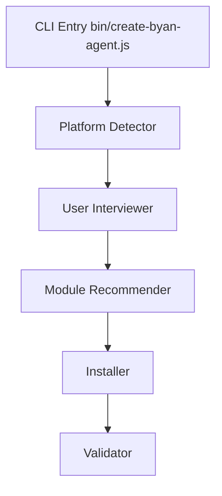

# BYAN v2.0 - Structure de Fichiers et Organisation

**Version:** 2.0.0-HYPER-MVP  
**Date:** 2026-02-04  
**Status:** Design Phase  
**Auteur:** Yan | Technical Writer: Paige

---

## Table des Matières

1. [Vue d'Ensemble](#vue-densemble)
2. [Arborescence Complète](#arborescence-complète)
3. [Description des Répertoires](#description-des-répertoires)
4. [Fichiers de Configuration](#fichiers-de-configuration)
5. [Conventions de Nommage](#conventions-de-nommage)
6. [Points d'Entrée](#points-dentrée)
7. [Installation avec Yanstaller](#installation-avec-yanstaller)
8. [Migration v1.0 vers v2.0](#migration-v10-vers-v20)
9. [Références](#références)

---

## Vue d'Ensemble

### Philosophie d'Organisation

BYAN v2.0 adopte une architecture modulaire basée sur **3 espaces distincts** :

```
┌─────────────────────────────────────────────────────────────┐
│                      BYAN v2.0 PROJECT                       │
├─────────────────────────────────────────────────────────────┤
│                                                              │
│  ┌──────────────┐  ┌──────────────┐  ┌─────────────────┐  │
│  │   _byan/     │  │     src/     │  │  _byan-output/  │  │
│  │   Platform   │  │    Runtime   │  │    Artifacts    │  │
│  │   Assets     │  │    Code      │  │    Generated    │  │
│  └──────────────┘  └──────────────┘  └─────────────────┘  │
│         │                  │                    │           │
│      Agents            Core Logic           Documents       │
│      Workflows         Components           Logs            │
│      Config            Tests                Cache           │
└─────────────────────────────────────────────────────────────┘
```

### Principes Structurels

1. **Séparation des Préoccupations**
   - `_byan/` : Assets de la plateforme (agents, workflows, configuration)
   - `src/` : Code runtime (core, observability)
   - `_byan-output/` : Outputs générés (logs, documents, cache)

2. **Modularité par Domaine**
   - Chaque module (BMM, BMB, CIS, TEA) est auto-contenu
   - Configuration hiérarchique avec héritage

3. **Convention over Configuration**
   - Structure de fichiers prévisible
   - Nommage standardisé
   - Découverte automatique des ressources

---

## Arborescence Complète

### Vue Niveau Racine

```
byan-v2/
├── _byan/                    # Plateforme BYAN - Assets et Configuration
├── _byan-output/             # Outputs générés (logs, docs, cache)
├── install/                  # Yanstaller - Installation Tool
├── src/                      # Code Runtime - Core Components
├── __tests__/                # Tests unitaires et intégration
├── node_modules/             # Dépendances NPM
├── package.json              # Configuration projet NPM
├── package-lock.json         # Lock file NPM
├── README.md                 # Documentation principale
├── GUIDE-UTILISATION.md      # Guide utilisateur
└── validate-agents.sh        # Script validation agents
```

### Vue Détaillée : `_byan/`

```
_byan/
├── _config/                           # Configuration Globale
│   ├── manifest.yaml                  # Manifeste principal
│   ├── agent-manifest.csv             # Index agents disponibles
│   ├── workflow-manifest.csv          # Index workflows
│   ├── task-manifest.csv              # Index tâches
│   ├── tool-manifest.csv              # Index outils
│   ├── files-manifest.csv             # Index fichiers
│   ├── bmad-help.csv                  # Messages d'aide
│   ├── agents/                        # Configurations agents
│   │   ├── bmm-pm.customize.yaml
│   │   ├── bmm-architect.customize.yaml
│   │   ├── bmm-dev.customize.yaml
│   │   └── ...
│   ├── ides/                          # Configurations IDE
│   │   └── codex.yaml
│   └── custom/                        # Extensions utilisateur
│
├── core/                              # Module Core (Système)
│   ├── agents/
│   │   ├── bmad-master.md            # Agent master BMAD
│   │   ├── carmack.md                # Token optimizer
│   │   └── test-dynamic.md           # Tests dynamiques
│   ├── base/
│   │   └── bmad-base-agent.md        # Template agent de base
│   ├── tasks/
│   │   ├── workflow.xml              # Processeur workflow
│   │   ├── help.md                   # Système d'aide
│   │   ├── editorial-review-prose.xml
│   │   ├── editorial-review-structure.xml
│   │   ├── index-docs.xml
│   │   ├── review-adversarial-general.xml
│   │   └── shard-doc.xml
│   ├── workflows/
│   │   ├── party-mode/
│   │   ├── brainstorming/
│   │   └── advanced-elicitation/
│   ├── resources/
│   │   └── excalidraw/               # Templates diagrammes
│   ├── config.yaml                   # Configuration module
│   └── module-help.csv               # Aide module
│
├── bmm/                               # BMM Module (Delivery Team)
│   ├── agents/
│   │   ├── pm.md                     # Product Manager
│   │   ├── analyst.md                # Business Analyst
│   │   ├── architect.md              # Solution Architect
│   │   ├── dev.md                    # Developer
│   │   ├── sm.md                     # Scrum Master
│   │   ├── ux-designer.md            # UX Designer
│   │   ├── quinn.md                  # QA Engineer
│   │   ├── quick-flow-solo-dev.md    # Solo dev workflow
│   │   ├── tech-writer/
│   │   │   └── tech-writer.md        # Technical Writer (Paige)
│   │   └── expert-merise-agile.md    # Expert Merise Agile
│   ├── workflows/
│   │   ├── 1-analysis/               # Phase analyse
│   │   ├── 2-plan-workflows/         # Phase planification
│   │   ├── 3-solutioning/            # Phase solution
│   │   ├── 4-implementation/         # Phase implémentation
│   │   ├── bmad-quick-flow/          # Workflow rapide
│   │   ├── document-project/         # Documentation projet
│   │   ├── excalidraw-diagrams/      # Génération diagrammes
│   │   ├── generate-project-context/ # Génération contexte
│   │   └── qa/                       # Quality Assurance
│   ├── teams/
│   │   ├── default-party.csv         # Équipe par défaut
│   │   └── team-fullstack.yaml       # Équipe fullstack
│   ├── data/
│   │   └── project-context-template.md
│   ├── config.yaml
│   └── module-help.csv
│
├── bmb/                               # BMB Module (Agent Builder)
│   ├── agents/
│   │   ├── agent-builder.md          # Constructeur agents
│   │   ├── module-builder.md         # Constructeur modules
│   │   ├── workflow-builder.md       # Constructeur workflows
│   │   ├── byan.md                   # Agent BYAN principal
│   │   ├── byan-test.md              # Version test BYAN
│   │   ├── drawio.md                 # Générateur diagrammes Draw.io
│   │   ├── marc.md                   # Copilot CLI specialist
│   │   ├── patnote.md                # Update manager
│   │   └── rachid.md                 # NPM/NPX deployment
│   ├── workflows/
│   │   ├── agent/
│   │   ├── byan/
│   │   ├── module/
│   │   └── workflow/
│   ├── config.yaml
│   └── module-help.csv
│
├── cis/                               # CIS Module (Creative Innovation)
│   ├── agents/
│   │   ├── brainstorming-coach.md
│   │   ├── creative-problem-solver.md
│   │   ├── design-thinking-coach.md
│   │   ├── innovation-strategist.md
│   │   ├── presentation-master.md
│   │   └── storyteller/
│   │       └── storyteller.md
│   ├── workflows/
│   │   ├── design-thinking/
│   │   ├── innovation-strategy/
│   │   ├── problem-solving/
│   │   ├── storytelling/
│   │   └── README.md
│   ├── teams/
│   │   ├── creative-squad.yaml
│   │   └── default-party.csv
│   ├── config.yaml
│   └── module-help.csv
│
├── tea/                               # TEA Module (Test Architecture)
│   ├── agents/
│   │   └── tea.md
│   ├── workflows/
│   │   └── testarch/
│   ├── teams/
│   │   └── default-party.csv
│   ├── testarch/
│   │   ├── knowledge/
│   │   └── tea-index.csv
│   ├── config.yaml
│   └── module-help.csv
│
└── _memory/                           # Agent Memory (Sidecar)
    ├── config.yaml
    ├── tech-writer-sidecar/
    │   └── documentation-standards.md
    └── storyteller-sidecar/
        ├── stories-told.md
        └── story-preferences.md
```

### Vue Détaillée : `src/`

```
src/
├── core/                              # Core Components
│   ├── context/
│   │   └── context.js                # ContextLayer implementation
│   ├── cache/
│   │   └── cache.js                  # Cache management
│   ├── dispatcher/
│   │   └── dispatcher.js             # EconomicDispatcher
│   ├── worker-pool/
│   │   └── worker-pool.js            # WorkerPool + Worker
│   └── workflow/
│       └── workflow-executor.js      # WorkflowExecutor
│
└── observability/                     # Observability Layer
    ├── logger/
    │   └── structured-logger.js      # Winston logger
    ├── metrics/
    │   └── metrics-collector.js      # Metrics collection
    └── dashboard/                     # Future: metrics dashboard
```

### Vue Détaillée : `_byan-output/`

```
_byan-output/
├── architecture/                      # Docs architecture
│   ├── byan-v2-0-architecture-node.md
│   ├── byan-v2-file-structure.md     # Ce document
│   └── diagrams/
│       ├── byan-v2-class-diagram.drawio
│       ├── byan-v2-component-diagram.drawio
│       ├── byan-v2-deployment-diagram.drawio
│       ├── byan-v2-sequence-agent.drawio
│       └── byan-v2-sequence-worker.drawio
│
├── conception/                        # Docs conception
│   ├── 01-vision-et-principes.md
│   ├── 03-composants/
│   │   ├── context-layer.md
│   │   ├── economic-dispatcher.md
│   │   ├── observability-layer.md
│   │   ├── worker-pool.md
│   │   ├── workflow-executor.md
│   │   └── README.md
│   ├── 04-interfaces-api.md
│   ├── 05-data-models.md
│   ├── 06-flux-de-donnees.md
│   ├── 07-decisions-architecturales.md
│   └── README.md
│
├── bmb-creations/                     # Agents créés par BMB
│   ├── expert-merise-agile.md
│   ├── franck/
│   └── yanstaller/
│       ├── ARCHITECTURE.md
│       ├── PLAN-DEVELOPPEMENT.md
│       └── README.md
│
├── implementation-artifacts/          # Tech specs & stories
│   ├── stories/
│   │   └── STORY-BYAN-001-stubs-composants-v2.md
│   ├── tech-spec-wip.md
│   └── tech-spec-yanstaller-complete-implementation.md
│
├── planning-artifacts/                # Planning docs
│
├── brainstorming/                     # Sessions brainstorming
│   └── brainstorming-session-2026-02-04.md
│
├── diagrams/                          # Diagrammes générés
│   ├── GUIDE-DRAWIO.md
│   └── TUTORIEL-MCP-DRAWIO.md
│
├── logs/                              # Logs runtime (future)
│   └── byan.log
│
├── cache/                             # Cache persistant (future)
│   └── context-cache.json
│
└── metrics/                           # Metrics data (future)
    └── metrics.json
```

### Vue Détaillée : `install/`

```
install/                               # Yanstaller - Installation Tool
├── bin/
│   └── create-byan-agent.js          # Point d'entrée CLI
│
├── lib/
│   ├── yanstaller/
│   │   ├── index.js                  # Core yanstaller
│   │   ├── detector.js               # Platform detection
│   │   ├── installer.js              # Installation logic
│   │   ├── interviewer.js            # User interview
│   │   ├── recommender.js            # Module recommender
│   │   ├── validator.js              # Validation
│   │   ├── wizard.js                 # Setup wizard
│   │   ├── backuper.js               # Backup management
│   │   └── troubleshooter.js         # Error handling
│   │
│   ├── platforms/
│   │   ├── index.js
│   │   ├── copilot-cli.js            # GitHub Copilot CLI
│   │   ├── vscode.js                 # VSCode
│   │   ├── claude-code.js            # Claude
│   │   └── codex.js                  # Codex
│   │
│   ├── utils/
│   │   ├── os-detector.js
│   │   ├── node-detector.js
│   │   ├── git-detector.js
│   │   ├── file-utils.js
│   │   ├── yaml-utils.js
│   │   ├── config-loader.js
│   │   └── logger.js
│   │
│   ├── errors.js
│   ├── exit-codes.js
│   └── templates/
│       └── agents/                   # Agent templates
│
├── __tests__/                        # Tests yanstaller
│   ├── yanstaller/
│   │   └── detector.test.js
│   ├── platforms/
│   │   ├── copilot-cli.test.js
│   │   ├── vscode.test.js
│   │   ├── claude-code.test.js
│   │   └── codex.test.js
│   ├── utils/
│   └── integration/
│       └── detection-flow.test.js
│
├── coverage/                         # Coverage reports
├── templates/                        # Installation templates
│   └── _byan/
│
├── package.json
├── package-lock.json
├── jest.config.js
├── install.sh
├── README.md
├── QUICKSTART.md
├── CHANGELOG.md
├── LICENSE
└── MARC-*.md                         # Marc (CLI specialist) docs
```

### Vue Détaillée : `__tests__/`

```
__tests__/                            # Tests BYAN v2.0
├── core/                             # Tests composants core
├── context.test.js                   # Tests ContextLayer
├── cache.test.js                     # Tests Cache
├── dispatcher.test.js                # Tests EconomicDispatcher
└── worker-pool.test.js               # Tests WorkerPool
```

---

## Description des Répertoires

### Répertoires de Niveau Racine

#### `_byan/`

**Rôle:** Plateforme BYAN - Assets et configuration.

**Contenu:**
- Agents (fichiers `.md`)
- Workflows (fichiers `.yaml`)
- Configuration modules (fichiers `config.yaml`)
- Templates et ressources

**Principe:** Tous les assets déclaratifs de la plateforme. Aucun code runtime.

**Modules intégrés:**

| Module | Nom Complet | Rôle |
|--------|-------------|------|
| `core` | Core Module | Système de base BMAD |
| `bmm` | BYAN Module Manager | Équipe de delivery |
| `bmb` | BYAN Module Builder | Construction agents/workflows |
| `cis` | Creative Innovation Suite | Innovation et créativité |
| `tea` | Test Architecture | Architecture de tests |

#### `src/`

**Rôle:** Code runtime - Composants core de BYAN v2.0.

**Contenu:**
- Implémentations des composants (JavaScript)
- Logique métier
- Observability layer

**Principe:** Code exécutable uniquement. Pas de configuration ni d'assets.

**Composants principaux:**

| Composant | Fichier | Description |
|-----------|---------|-------------|
| ContextLayer | `src/core/context/context.js` | Gestion context hiérarchique |
| Cache | `src/core/cache/cache.js` | Cache in-memory LRU |
| EconomicDispatcher | `src/core/dispatcher/dispatcher.js` | Routing intelligent |
| WorkerPool | `src/core/worker-pool/worker-pool.js` | Pool de workers |
| WorkflowExecutor | `src/core/workflow/workflow-executor.js` | Exécution workflows |
| StructuredLogger | `src/observability/logger/structured-logger.js` | Logs structurés |
| MetricsCollector | `src/observability/metrics/metrics-collector.js` | Collecte metrics |

#### `_byan-output/`

**Rôle:** Outputs générés par la plateforme.

**Contenu:**
- Documents générés
- Logs runtime
- Cache persistant
- Métriques

**Principe:** Fichiers éphémères ou générés. Gitignore recommandé pour `logs/`, `cache/`, `metrics/`.

**Sous-répertoires:**

| Répertoire | Rôle | Gitignore |
|------------|------|-----------|
| `architecture/` | Docs architecture | Non |
| `conception/` | Docs conception | Non |
| `bmb-creations/` | Agents créés | Non |
| `implementation-artifacts/` | Stories, specs | Non |
| `planning-artifacts/` | Planning docs | Non |
| `brainstorming/` | Sessions brainstorming | Non |
| `diagrams/` | Diagrammes générés | Non |
| `logs/` | Logs runtime | **Oui** |
| `cache/` | Cache persistant | **Oui** |
| `metrics/` | Métriques | **Oui** |

#### `install/`

**Rôle:** Yanstaller - Outil d'installation BYAN.

**Contenu:**
- CLI installation (`npx create-byan-agent`)
- Détection plateforme multi-OS
- Setup wizard interactif
- Tests installation

**Distribution:**
- Package NPM: `create-byan-agent`
- Exécution: `npx create-byan-agent`

**Architecture:**



#### `__tests__/`

**Rôle:** Tests unitaires et intégration BYAN v2.0.

**Framework:** Jest (configuré dans `package.json`)

**Coverage cible:** 80%+ (branches, functions, lines, statements)

**Tests existants:**

| Test | Fichier | Scope |
|------|---------|-------|
| ContextLayer | `__tests__/context.test.js` | Context management |
| Cache | `__tests__/cache.test.js` | Cache operations |
| Dispatcher | `__tests__/dispatcher.test.js` | Routing logic |
| WorkerPool | `__tests__/worker-pool.test.js` | Worker management |

### Modules BMAD

#### Module `core`

**Nom:** Core Module  
**Rôle:** Système de base BMAD (workflow processor, help system, base templates)

**Agents clés:**

| Agent | Fichier | Description |
|-------|---------|-------------|
| bmad-master | `core/agents/bmad-master.md` | Agent master orchestrateur |
| carmack | `core/agents/carmack.md` | Token optimizer (compression prompts) |
| test-dynamic | `core/agents/test-dynamic.md` | Tests dynamiques |

**Workflows:**
- `party-mode/` : Collaboration multi-agents
- `brainstorming/` : Sessions créatives
- `advanced-elicitation/` : Extraction besoins avancée

**Tasks:**
- `workflow.xml` : Processeur workflow (CŒUR DU SYSTÈME)
- `help.md` : Système d'aide contextuel
- Editorial review tasks
- Document indexing

#### Module `bmm`

**Nom:** BYAN Module Manager  
**Rôle:** Équipe de delivery complète (PM, Architect, Dev, QA, etc.)

**Agents (équipe fullstack):**

| Agent | Fichier | Persona |
|-------|---------|---------|
| pm | `bmm/agents/pm.md` | Product Manager |
| analyst | `bmm/agents/analyst.md` | Business Analyst |
| architect | `bmm/agents/architect.md` | Solution Architect |
| dev | `bmm/agents/dev.md` | Developer |
| sm | `bmm/agents/sm.md` | Scrum Master |
| ux-designer | `bmm/agents/ux-designer.md` | UX Designer |
| quinn | `bmm/agents/quinn.md` | QA Engineer |
| tech-writer | `bmm/agents/tech-writer/tech-writer.md` | Technical Writer (Paige) |
| expert-merise-agile | `bmm/agents/expert-merise-agile.md` | Expert Merise Agile |

**Workflows (phases delivery):**

| Phase | Répertoire | Description |
|-------|------------|-------------|
| Analysis | `1-analysis/` | Analyse besoins métier |
| Planning | `2-plan-workflows/` | Planification projet |
| Solutioning | `3-solutioning/` | Conception solution |
| Implementation | `4-implementation/` | Implémentation |
| QA | `qa/` | Quality Assurance |

**Workflows spéciaux:**
- `bmad-quick-flow/` : Workflow rapide solo-dev
- `document-project/` : Documentation complète projet
- `excalidraw-diagrams/` : Génération diagrammes
- `generate-project-context/` : Génération contexte projet

**Teams:**
- `team-fullstack.yaml` : Équipe complète
- `default-party.csv` : Équipe par défaut party-mode

#### Module `bmb`

**Nom:** BYAN Module Builder  
**Rôle:** Construction et maintenance agents/workflows/modules

**Agents (builders):**

| Agent | Fichier | Spécialité |
|-------|---------|------------|
| agent-builder | `bmb/agents/agent-builder.md` | Création agents |
| module-builder | `bmb/agents/module-builder.md` | Création modules |
| workflow-builder | `bmb/agents/workflow-builder.md` | Création workflows |
| byan | `bmb/agents/byan.md` | Agent BYAN principal (interview) |
| drawio | `bmb/agents/drawio.md` | Générateur diagrammes Draw.io |
| marc | `bmb/agents/marc.md` | Copilot CLI integration specialist |
| patnote | `bmb/agents/patnote.md` | Update manager & conflict resolution |
| rachid | `bmb/agents/rachid.md` | NPM/NPX deployment specialist |

**Workflows:**
- `agent/` : Workflows création agents
- `byan/` : Workflows spécifiques BYAN
- `module/` : Workflows création modules
- `workflow/` : Workflows création workflows

#### Module `cis`

**Nom:** Creative Innovation Suite  
**Rôle:** Innovation, créativité, design thinking

**Agents (creative team):**

| Agent | Fichier | Expertise |
|-------|---------|-----------|
| brainstorming-coach | `cis/agents/brainstorming-coach.md` | Animation brainstorming |
| creative-problem-solver | `cis/agents/creative-problem-solver.md` | Résolution problèmes créative |
| design-thinking-coach | `cis/agents/design-thinking-coach.md` | Design Thinking |
| innovation-strategist | `cis/agents/innovation-strategist.md` | Stratégie innovation |
| presentation-master | `cis/agents/presentation-master.md` | Présentations impactantes |
| storyteller | `cis/agents/storyteller/storyteller.md` | Storytelling |

**Workflows:**
- `design-thinking/` : Méthodologie Design Thinking
- `innovation-strategy/` : Stratégie d'innovation
- `problem-solving/` : Résolution problèmes
- `storytelling/` : Création narratives

**Teams:**
- `creative-squad.yaml` : Équipe créative

#### Module `tea`

**Nom:** Test Architecture  
**Rôle:** Architecture de tests et qualité

**Agents:**

| Agent | Fichier | Rôle |
|-------|---------|------|
| tea | `tea/agents/tea.md` | Test Architect |

**Workflows:**
- `testarch/` : Architecture tests

**Knowledge:**
- `testarch/knowledge/` : Base de connaissances tests
- `testarch/tea-index.csv` : Index ressources

### Répertoire `_memory`

**Rôle:** Mémoire persistante des agents (sidecar memory)

**Principe:** Chaque agent peut avoir un sous-répertoire pour stocker ses préférences, historique, apprentissages.

**Exemple:**

```
_memory/
├── config.yaml
├── tech-writer-sidecar/
│   └── documentation-standards.md      # Standards docs de Paige
└── storyteller-sidecar/
    ├── stories-told.md                 # Historique histoires
    └── story-preferences.md            # Préférences utilisateur
```

**Usage:**
- Agent peut lire/écrire dans son sidecar
- Persistance entre sessions
- Apprentissage progressif

---

## Fichiers de Configuration

### Configuration Hiérarchique

BYAN v2.0 utilise une configuration hiérarchique avec héritage:

```
Global Config (_byan/_config/manifest.yaml)
├─ Module Config (_byan/{module}/config.yaml)
│  ├─ Agent Config (_byan/_config/agents/{agent}.customize.yaml)
│  └─ IDE Config (_byan/_config/ides/codex.yaml)
│
└─ Project Config (package.json)
```

### Fichiers de Configuration Principaux

#### `package.json` (Racine Projet)

**Rôle:** Configuration NPM projet BYAN v2.0

**Champs clés:**

```json
{
  "name": "byan-v2",
  "version": "2.0.0-alpha.1",
  "description": "BYAN v2.0 - Build Your AI Network - Hyper-MVP",
  "main": "src/index.js",
  "scripts": {
    "test": "jest",
    "test:coverage": "jest --coverage",
    "test:watch": "jest --watch"
  },
  "keywords": ["byan", "ai", "multi-agent", "workflow"],
  "author": "Yan",
  "license": "MIT"
}
```

**Dependencies (à ajouter pour HYPER-MVP):**

```json
{
  "dependencies": {
    "js-yaml": "^4.1.0",
    "node-cache": "^5.1.2",
    "winston": "^3.11.0",
    "fs-extra": "^11.2.0"
  },
  "devDependencies": {
    "jest": "^29.7.0"
  }
}
```

#### `_byan/_config/manifest.yaml`

**Rôle:** Manifeste principal BMAD (modules, versions, dépendances)

**Structure:**

```yaml
bmad_version: "6.0.0-Beta.5"
modules:
  - name: core
    version: "6.0.0"
    enabled: true
  - name: bmm
    version: "6.0.0"
    enabled: true
  - name: bmb
    version: "6.0.0"
    enabled: true
  - name: cis
    version: "1.0.0"
    enabled: true
  - name: tea
    version: "1.0.0"
    enabled: false

global_settings:
  output_folder: "_byan-output"
  log_level: "info"
  cache_ttl: 300
```

#### `_byan/bmm/config.yaml`

**Rôle:** Configuration du module BMM

**Exemple:**

```yaml
project_name: conception
user_skill_level: intermediate
planning_artifacts: "{project-root}/_byan-output/planning-artifacts"
implementation_artifacts: "{project-root}/_byan-output/implementation-artifacts"
project_knowledge: "{project-root}/docs"

user_name: Yan
communication_language: Francais
document_output_language: Francais
output_folder: "{project-root}/_byan-output"
```

**Placeholders supportés:**
- `{project-root}` : Racine projet
- `{user_name}` : Nom utilisateur
- `{output_folder}` : Dossier outputs

#### Agent Customization Files

**Location:** `_byan/_config/agents/`

**Nom:** `{module}-{agent-name}.customize.yaml`

**Exemple:** `_byan/_config/agents/bmm-pm.customize.yaml`

```yaml
agent_id: "bmm/pm"
customizations:
  communication_style: "formal"
  output_format: "markdown"
  mantras_priority:
    - "IA-1"
    - "IA-16"
    - "#37"
  tools_enabled:
    - "file-operations"
    - "git-commands"
    - "web-search"
```

### Manifestes CSV

#### `_byan/_config/agent-manifest.csv`

**Rôle:** Index de tous les agents disponibles

**Format:**

```csv
module,agent_name,file_path,persona,enabled
bmm,pm,_byan/bmm/agents/pm.md,Product Manager,true
bmm,architect,_byan/bmm/agents/architect.md,Solution Architect,true
bmb,agent-builder,_byan/bmb/agents/agent-builder.md,Agent Builder,true
```

#### `_byan/_config/workflow-manifest.csv`

**Rôle:** Index de tous les workflows

**Format:**

```csv
module,workflow_name,path,description,enabled
bmm,document-project,_byan/bmm/workflows/document-project/workflow.yaml,Generate project documentation,true
bmm,bmad-quick-flow,_byan/bmm/workflows/bmad-quick-flow/workflow.yaml,Quick solo-dev workflow,true
```

#### `_byan/_config/bmad-help.csv`

**Rôle:** Messages d'aide contextuels

**Format:**

```csv
context,command,help_message
workflow,execute,"Execute a workflow: byan workflow execute <path>"
agent,activate,"Activate an agent: byan agent activate <name>"
context,load,"Load context: byan context load <level> <id>"
```

---

## Conventions de Nommage

### Fichiers

#### Agents (`.md`)

**Convention:** `{agent-name}.md` (lowercase with hyphens)

**Exemples:**
- `pm.md` (Product Manager)
- `tech-writer.md` (Technical Writer)
- `expert-merise-agile.md` (Expert Merise Agile)

**Structure interne:**

```markdown
---
name: "agent name"
description: "Short description"
---

<agent id="{module}/{agent-name}" name="DisplayName" icon="emoji">
...
</agent>
```

#### Workflows (`.yaml`)

**Convention:** `workflow.yaml` (dans un dossier nommé)

**Exemples:**
- `_byan/bmm/workflows/document-project/workflow.yaml`
- `_byan/bmm/workflows/bmad-quick-flow/workflow.yaml`

**Structure:**

```yaml
name: workflow_name
description: Workflow description
version: "1.0.0"

steps:
  - id: step_id
    type: worker|agent
    ...
```

#### Configuration (`.yaml`)

**Convention:** `config.yaml` ou `{entity}.customize.yaml`

**Exemples:**
- `_byan/bmm/config.yaml` (module config)
- `_byan/_config/agents/bmm-pm.customize.yaml` (agent customization)

#### Code JavaScript (`.js`)

**Convention:** `{component-name}.js` (lowercase with hyphens)

**Exemples:**
- `context.js`
- `worker-pool.js`
- `structured-logger.js`

**Classe:** PascalCase (ex: `ContextLayer`, `WorkerPool`)

#### Tests (`.test.js`)

**Convention:** `{component-name}.test.js`

**Exemples:**
- `context.test.js`
- `dispatcher.test.js`
- `worker-pool.test.js`

### Répertoires

#### Modules

**Convention:** Acronyme lowercase (3-4 lettres)

**Exemples:**
- `bmm` (BYAN Module Manager)
- `bmb` (BYAN Module Builder)
- `cis` (Creative Innovation Suite)
- `tea` (Test Architecture)

#### Workflows

**Convention:** `{phase-number}-{workflow-name}/` ou `{workflow-name}/`

**Exemples:**
- `1-analysis/`
- `2-plan-workflows/`
- `document-project/`
- `bmad-quick-flow/`

#### Composants

**Convention:** `{component-name}/` (lowercase with hyphens)

**Exemples:**
- `core/context/`
- `core/worker-pool/`
- `observability/logger/`

### Identifiants

#### Agent IDs

**Convention:** `{module}/{agent-name}`

**Exemples:**
- `bmm/pm`
- `bmm/architect`
- `bmb/agent-builder`
- `cis/brainstorming-coach`

#### Step IDs (Workflows)

**Convention:** `{action}_{subject}` (snake_case)

**Exemples:**
- `analyze_requirements`
- `generate_prd`
- `validate_schema`
- `format_output`

---

## Points d'Entrée

### CLI Yanstaller

**Installation:**

```bash
npx create-byan-agent
```

**Point d'entrée:** `install/bin/create-byan-agent.js`

**Flow:**

```
User runs npx create-byan-agent
├─ Detect platform (Copilot CLI, VSCode, Claude, Codex)
├─ Interview user (project type, tech stack)
├─ Recommend modules (BMM, BMB, CIS, TEA)
├─ Install selected modules
├─ Generate config (_byan/bmm/config.yaml)
├─ Validate installation
└─ Display success message + quickstart
```

### Runtime (BYAN v2.0)

**Point d'entrée (futur):** `src/index.js`

**API principale:**

```javascript
// Future API
const { ContextLayer, EconomicDispatcher, WorkerPool, WorkflowExecutor } = require('byan-v2');

// Initialize
const context = new ContextLayer();
const dispatcher = new EconomicDispatcher();
const workerPool = new WorkerPool(2);
const executor = new WorkflowExecutor(context, dispatcher);

// Execute workflow
const result = await executor.execute('_byan/workflows/my-workflow/workflow.yaml');
```

### Agents (via IDE)

**Copilot CLI:**

```bash
@bmm-pm Hello, I need help with a PRD
@bmm-architect Design an API for user authentication
@tech-writer Create documentation for this feature
```

**VSCode:**

```
# Dans Copilot Chat
@workspace use agent @bmm-dev
@workspace use agent @bmm-quinn
```

**Claude:**

```
Load agent: bmm/pm
Execute workflow: document-project
```

### Tests

**Exécution:**

```bash
npm test                 # Tous les tests
npm run test:coverage    # Avec coverage
npm run test:watch       # Mode watch
```

**Point d'entrée:** Jest framework (config dans `package.json`)

---

## Installation avec Yanstaller

### Processus d'Installation

**Yanstaller** est l'outil officiel d'installation BYAN v2.0, distribué via NPM.

#### Étape 1: Démarrage

```bash
npx create-byan-agent
```

**Sortie:**

```
╔═══════════════════════════════════════════════════╗
║  BYAN v2.0 Installation Wizard                    ║
║  Build Your AI Network                            ║
╚═══════════════════════════════════════════════════╝

🔍 Detecting your environment...
✓ OS: Linux (Ubuntu 22.04)
✓ Node.js: v18.19.0
✓ Git: v2.34.1
✓ Platform: GitHub Copilot CLI
```

#### Étape 2: Interview Utilisateur

```
📋 Project Setup

? What type of project are you working on?
  ❯ Web Application
    Mobile App
    API/Backend
    Data Science
    Other

? What is your tech stack?
  ❯ Node.js / JavaScript
    Python
    Java / Spring Boot
    .NET / C#
    Go
    Other

? What is your role?
  ❯ Full-stack Developer
    Frontend Developer
    Backend Developer
    Product Manager
    Architect
    Other

? What is your experience level?
  ❯ Beginner
    Intermediate
    Expert
```

#### Étape 3: Recommandation Modules

```
🎯 Recommended Modules

Based on your answers, we recommend:

✓ BMM (BYAN Module Manager)
  Full delivery team (PM, Architect, Dev, QA)
  Workflows: Analysis → Planning → Implementation
  
✓ BMB (BYAN Module Builder)
  Create custom agents and workflows
  Agent: BYAN, Agent Builder, Workflow Builder
  
○ CIS (Creative Innovation Suite)
  Innovation, design thinking, brainstorming
  (Optional - useful for product ideation)
  
○ TEA (Test Architecture)
  Test architecture and quality
  (Optional - useful for QA-focused projects)

? Which modules do you want to install?
  ❯ ☑ BMM (BYAN Module Manager)
    ☑ BMB (BYAN Module Builder)
    ☐ CIS (Creative Innovation Suite)
    ☐ TEA (Test Architecture)
```

#### Étape 4: Installation

```
📦 Installing BYAN v2.0...

Creating directories...
✓ _byan/
✓ _byan/bmm/
✓ _byan/bmb/
✓ _byan/core/
✓ _byan/_config/
✓ _byan-output/

Copying files...
✓ BMM agents (8 agents)
✓ BMM workflows (7 workflows)
✓ BMB agents (8 agents)
✓ BMB workflows (4 workflows)
✓ Core system files
✓ Configuration templates

Generating config...
✓ _byan/bmm/config.yaml
✓ _byan/_config/manifest.yaml

Installing dependencies...
✓ js-yaml@4.1.0
✓ node-cache@5.1.2
✓ winston@3.11.0
✓ fs-extra@11.2.0

Validating installation...
✓ File structure
✓ Configuration
✓ Agent manifests
✓ Workflow definitions

✨ Installation complete!
```

#### Étape 5: Post-Installation

```
╔═══════════════════════════════════════════════════╗
║  BYAN v2.0 Installation Successful!               ║
╚═══════════════════════════════════════════════════╝

📚 Getting Started:

1. Activate your first agent:
   @bmm-pm Hello, I need help with a project

2. Run a workflow:
   @bmm-pm use workflow document-project

3. Read documentation:
   - README.md
   - GUIDE-UTILISATION.md
   - _byan-output/architecture/byan-v2-file-structure.md

🔧 Configuration:
   Edit: _byan/bmm/config.yaml

📖 Documentation:
   https://github.com/your-repo/byan-v2

🐛 Issues:
   https://github.com/your-repo/byan-v2/issues

Happy Building! 🚀
```

### Structure Installée

**Après installation (BMM + BMB):**

```
my-project/
├── _byan/
│   ├── core/                 # Module Core (toujours installé)
│   ├── bmm/                  # Module BMM (sélectionné)
│   ├── bmb/                  # Module BMB (sélectionné)
│   ├── _config/
│   │   ├── manifest.yaml
│   │   ├── agent-manifest.csv
│   │   └── agents/
│   └── _memory/
│       └── config.yaml
│
├── _byan-output/
│   └── (vide initialement)
│
├── package.json              # Mis à jour avec dependencies
└── node_modules/             # Dependencies installées
```

### Customization Post-Installation

#### Éditer Configuration Utilisateur

```yaml
# _byan/bmm/config.yaml
project_name: my-awesome-project
user_name: Yan
communication_language: Francais
user_skill_level: intermediate
output_folder: "{project-root}/_byan-output"
```

#### Activer/Désactiver Agents

```yaml
# _byan/_config/agents/bmm-pm.customize.yaml
agent_id: "bmm/pm"
customizations:
  enabled: true
  communication_style: "casual"
  output_format: "markdown"
```

#### Ajouter Module Additionnel

```bash
npx create-byan-agent --add-module cis
```

---

## Migration v1.0 vers v2.0

### Changements Majeurs

#### Architecture

**BYAN v1.0:**

```
byan-v1/
├── agents/                   # Tous les agents dans un dossier
├── workflows/                # Tous les workflows dans un dossier
├── config.yaml               # Configuration unique
└── src/
    └── byan.js               # Fichier unique monolithique
```

**BYAN v2.0:**

```
byan-v2/
├── _byan/                    # Plateforme modulaire
│   ├── bmm/                  # Module BMM
│   ├── bmb/                  # Module BMB
│   ├── cis/                  # Module CIS
│   └── core/                 # Core system
├── src/                      # Code runtime séparé
│   ├── core/                 # Composants core
│   └── observability/        # Observability layer
└── _byan-output/             # Outputs séparés
```

#### Context Management

**v1.0:**

```javascript
// Context passé manuellement
const context = {
  company_name: "Acme",
  project_name: "ERP",
  user_name: "Yan"
};
agent.execute(task, context);
```

**v2.0:**

```javascript
// Context hiérarchique avec héritage
const contextLayer = new ContextLayer();
const context = await contextLayer.loadContext('story', {
  projectId: 'erp-system',
  storyId: 'US-123'
});
// Héritage automatique: Platform → Project → Story
```

#### Routing

**v1.0:**

```javascript
// Tous les tasks vont à l'agent (coûteux)
const result = await agent.execute(task);
```

**v2.0:**

```javascript
// Routing intelligent basé complexité
const dispatcher = new EconomicDispatcher();
const executor = await dispatcher.routeTask(task);
const result = await executor.execute(task);
// → Worker (60%) ou Agent (40%)
```

### Guide de Migration

#### Étape 1: Backup v1.0

```bash
cp -r byan-v1 byan-v1-backup
cd byan-v1
```

#### Étape 2: Installer v2.0

```bash
npx create-byan-agent
# Sélectionner modules équivalents à v1.0
```

#### Étape 3: Migrer Agents Personnalisés

**v1.0:** `agents/my-custom-agent.md`

**Migration:**

1. Identifier le module approprié (BMM, BMB, CIS)
2. Copier dans `_byan/{module}/agents/`
3. Ajouter entrée dans `_byan/_config/agent-manifest.csv`

```csv
bmm,my-custom-agent,_byan/bmm/agents/my-custom-agent.md,Custom Agent,true
```

#### Étape 4: Migrer Workflows

**v1.0:** `workflows/my-workflow.yaml`

**Migration:**

1. Copier dans `_byan/{module}/workflows/my-workflow/`
2. Renommer en `workflow.yaml`
3. Adapter format si nécessaire:

```yaml
# v2.0 format
name: my_workflow
description: My workflow description
version: "1.0.0"

steps:
  - id: step_1
    type: worker   # Nouveau: peut être 'worker' ou 'agent'
    input: "Task description"
    retry:         # Nouveau: retry logic
      max_attempts: 3
```

#### Étape 5: Migrer Configuration

**v1.0:** `config.yaml`

**Migration:**

```bash
# Copier valeurs vers nouveau format
vi _byan/bmm/config.yaml
```

**Mapping:**

| v1.0 | v2.0 |
|------|------|
| `user_name` | `user_name` (identique) |
| `project_name` | `project_name` (identique) |
| `output_path` | `output_folder` |
| `log_level` | `_byan/_config/manifest.yaml` |

#### Étape 6: Tester

```bash
npm test
# Vérifier que tous les tests passent

# Tester agent
@bmm-pm Hello

# Tester workflow
@bmm-pm use workflow my-workflow
```

### Breaking Changes

#### Chemins de Fichiers

**v1.0:**

```javascript
const agentPath = 'agents/pm.md';
const workflowPath = 'workflows/create-prd.yaml';
```

**v2.0:**

```javascript
const agentPath = '_byan/bmm/agents/pm.md';
const workflowPath = '_byan/bmm/workflows/create-prd/workflow.yaml';
```

#### API Interne

**v1.0:**

```javascript
const Byan = require('./src/byan');
const byan = new Byan(config);
await byan.executeWorkflow('create-prd');
```

**v2.0:**

```javascript
const { WorkflowExecutor, ContextLayer, EconomicDispatcher } = require('byan-v2');
const context = new ContextLayer();
const dispatcher = new EconomicDispatcher();
const executor = new WorkflowExecutor(context, dispatcher);
await executor.execute('_byan/bmm/workflows/create-prd/workflow.yaml');
```

#### Format Workflow

**v1.0:**

```yaml
name: create-prd
steps:
  - name: step1
    agent: pm
    prompt: "Generate PRD"
```

**v2.0:**

```yaml
name: create-prd
steps:
  - id: step1              # 'id' au lieu de 'name'
    type: agent            # Nouveau champ obligatoire
    agent: pm
    input: "Generate PRD"  # 'input' au lieu de 'prompt'
    retry:                 # Nouveau: retry logic
      max_attempts: 2
```

### Compatibilité

#### Rétrocompatibilité

**Non supporté:**
- Anciens chemins de fichiers
- Ancien format workflow (v1.0)
- API interne v1.0

**Migration requise** pour tous les projets v1.0.

#### Outils de Migration

```bash
# Future: outil automatique
npx byan-migrate v1-to-v2
```

---

## Références

### Documents Architecture

- [Architecture Technique BYAN v2.0](./byan-v2-0-architecture-node.md)
- [Vision et Principes](../_byan-output/conception/01-vision-et-principes.md)
- [Interfaces API](../_byan-output/conception/04-interfaces-api.md)
- [Data Models](../_byan-output/conception/05-data-models.md)
- [Flux de Données](../_byan-output/conception/06-flux-de-donnees.md)
- [Décisions Architecturales](../_byan-output/conception/07-decisions-architecturales.md)

### Diagrammes UML

- [Class Diagram](./diagrams/byan-v2-class-diagram.drawio)
- [Component Diagram](./diagrams/byan-v2-component-diagram.drawio)
- [Deployment Diagram](./diagrams/byan-v2-deployment-diagram.drawio)
- [Sequence: Worker Flow](./diagrams/byan-v2-sequence-worker.drawio)
- [Sequence: Agent Flow](./diagrams/byan-v2-sequence-agent.drawio)

### Composants Core

- [ContextLayer](../_byan-output/conception/03-composants/context-layer.md)
- [EconomicDispatcher](../_byan-output/conception/03-composants/economic-dispatcher.md)
- [WorkerPool](../_byan-output/conception/03-composants/worker-pool.md)
- [WorkflowExecutor](../_byan-output/conception/03-composants/workflow-executor.md)
- [ObservabilityLayer](../_byan-output/conception/03-composants/observability-layer.md)

### Guides Installation

- [Guide Yanstaller](../install/README.md)
- [Quickstart](../install/QUICKSTART.md)
- [Guide Installation Simple](../install/GUIDE-INSTALLATION-SIMPLE.md)

### Sessions Design

- [Brainstorming Session 2026-02-04](../_byan-output/brainstorming/brainstorming-session-2026-02-04.md)

### Standards

- [Documentation Standards](../_byan/_memory/tech-writer-sidecar/documentation-standards.md)
- [Merise Agile TDD Mantras](../_byan-output/guide-reference-rapide-merise-agile-tdd.md)

---

## Annexes

### Checklist Création Nouveau Module

Pour créer un nouveau module BMAD:

- [ ] Créer répertoire `_byan/{module-name}/`
- [ ] Créer `config.yaml` avec settings module
- [ ] Créer `module-help.csv` avec aide contextuelle
- [ ] Créer sous-répertoires:
  - [ ] `agents/`
  - [ ] `workflows/`
  - [ ] `teams/` (optionnel)
  - [ ] `data/` (optionnel)
- [ ] Ajouter agents (fichiers `.md`)
- [ ] Ajouter workflows (répertoires avec `workflow.yaml`)
- [ ] Mettre à jour `_byan/_config/manifest.yaml`
- [ ] Mettre à jour `_byan/_config/agent-manifest.csv`
- [ ] Mettre à jour `_byan/_config/workflow-manifest.csv`
- [ ] Créer customization files dans `_byan/_config/agents/`
- [ ] Documenter dans README module
- [ ] Créer tests si applicable

### Checklist Création Nouvel Agent

Pour créer un nouvel agent dans un module existant:

- [ ] Créer fichier `_byan/{module}/agents/{agent-name}.md`
- [ ] Définir persona et capabilities
- [ ] Créer menu avec items
- [ ] Ajouter entrée dans `_byan/_config/agent-manifest.csv`
- [ ] Créer `_byan/_config/agents/{module}-{agent-name}.customize.yaml`
- [ ] Documenter agent dans module README
- [ ] Tester activation agent
- [ ] Ajouter à team file si applicable (`teams/{team-name}.yaml`)

### Checklist Création Nouveau Workflow

Pour créer un nouveau workflow:

- [ ] Créer répertoire `_byan/{module}/workflows/{workflow-name}/`
- [ ] Créer `workflow.yaml` avec steps
- [ ] Définir inputs/outputs
- [ ] Ajouter retry logic si nécessaire
- [ ] Tester exécution workflow
- [ ] Ajouter entrée dans `_byan/_config/workflow-manifest.csv`
- [ ] Documenter dans README workflow
- [ ] Créer fichiers support (templates, data) si nécessaire

### Glossaire

| Terme | Définition |
|-------|------------|
| **Agent** | Entité IA avec expertise métier (modèle puissant comme Sonnet) |
| **Worker** | Exécuteur léger pour tâches simples (modèle rapide comme Haiku) |
| **Context** | État situationnel hiérarchique avec héritage multi-niveaux |
| **Workflow** | Orchestration déclarative de processus complexes (YAML DSL) |
| **Dispatcher** | Routeur intelligent basé sur complexité de tâche |
| **Module** | Collection cohérente d'agents, workflows et configuration |
| **Yanstaller** | Outil d'installation BYAN v2.0 (npx create-byan-agent) |
| **Sidecar** | Mémoire persistante d'un agent (dans `_memory/`) |
| **Manifest** | Index de ressources (agents, workflows, tasks, tools) |
| **Party Mode** | Collaboration multi-agents en temps réel |
| **Merise Agile** | Méthodologie combinant Merise (conception) et Agile (delivery) |
| **TDD** | Test-Driven Development (développement piloté par les tests) |

---

**Document généré le 2026-02-04**  
*BYAN v2.0 - Structure de Fichiers et Organisation*  
*Auteur: Yan | Technical Writer: Paige*  
*Version: 2.0.0-HYPER-MVP*