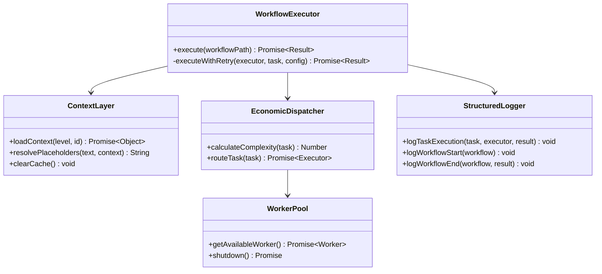

# BYAN v2.0 - Interfaces et API

**Version:** 2.0.0-HYPER-MVP  
**Date:** 2026-02-04  
**Status:** Design Phase  
**Auteur:** Yan

---

## Table des matières

- [Vue d'ensemble](#vue-densemble)
- [ContextLayer](#contextlayer)
- [EconomicDispatcher](#economicdispatcher)
- [WorkerPool](#workerpool)
- [WorkflowExecutor](#workflowexecutor)
- [ObservabilityLayer](#observabilitylayer)
- [Error Handling](#error-handling)

---

## Vue d'ensemble

BYAN v2.0 expose 5 classes principales formant l'API publique du système.

### Architecture des Composants



### Flux d'Utilisation Typique

```javascript
// 1. Initialiser les composants
const contextLayer = new ContextLayer();
const workerPool = new WorkerPool(2);
const agentRegistry = new AgentRegistry();
const dispatcher = new EconomicDispatcher(workerPool, agentRegistry);
const logger = new StructuredLogger();
const executor = new WorkflowExecutor(contextLayer, dispatcher, logger);

// 2. Charger le context
const context = await contextLayer.loadContext('story', {
  projectId: 'erp-system',
  storyId: 'US-123'
});

// 3. Exécuter un workflow
const result = await executor.execute(
  '_byan/workflows/create-prd/workflow.yaml',
  context
);

// 4. Récupérer les résultats
console.log(`Workflow completed: ${result.success}`);
console.log(`Steps executed: ${result.stepsExecuted}`);
```

---

## ContextLayer

### Description

Gère le context hiérarchique multi-niveaux avec héritage et cache LRU.

### Emplacement

```
_byan/core/context.js
```

### Interface Publique

```javascript
class ContextLayer {
  /**
   * Charge un context à un niveau hiérarchique donné
   * 
   * @param {string} level - Niveau: 'platform' | 'project' | 'story'
   * @param {Object} [id] - Identifiants selon niveau
   * @param {string} [id.projectId] - ID projet (requis pour 'project' et 'story')
   * @param {string} [id.storyId] - ID story (requis pour 'story')
   * @returns {Promise<Object>} Context merged avec héritage
   * @throws {Error} Si fichier context introuvable ou invalide
   * 
   * @example
   * // Platform context (global)
   * const platformCtx = await contextLayer.loadContext('platform');
   * 
   * @example
   * // Project context (hérite de platform)
   * const projectCtx = await contextLayer.loadContext('project', {
   *   projectId: 'erp-system'
   * });
   * 
   * @example
   * // Story context (hérite de platform + project)
   * const storyCtx = await contextLayer.loadContext('story', {
   *   projectId: 'erp-system',
   *   storyId: 'US-123'
   * });
   */
  async loadContext(level, id = null) { }
  
  /**
   * Résout les placeholders dans un texte avec le context fourni
   * 
   * @param {string} text - Texte avec placeholders {key}
   * @param {Object} context - Context pour résolution
   * @returns {string} Texte avec placeholders remplacés
   * 
   * @example
   * const text = "Company: {company_name}, Project: {project_name}";
   * const resolved = contextLayer.resolvePlaceholders(text, context);
   * // "Company: Acme Corp, Project: ERP System"
   */
  resolvePlaceholders(text, context) { }
  
  /**
   * Vide le cache context
   * Utile pour forcer un reload après modification fichiers
   * 
   * @example
   * contextLayer.clearCache();
   */
  clearCache() { }
  
  /**
   * Retourne les statistiques du cache
   * 
   * @returns {Object} Stats: hits, misses, size
   * 
   * @example
   * const stats = contextLayer.getCacheStats();
   * console.log(`Cache hit rate: ${stats.hits / (stats.hits + stats.misses)}`);
   */
  getCacheStats() { }
}
```

### Exemples d'Utilisation

#### Exemple 1 : Chargement Platform Context

```javascript
const contextLayer = new ContextLayer();

// Charger context global (platform)
const platformContext = await contextLayer.loadContext('platform');

console.log(platformContext);
// Output:
// {
//   company_name: "Acme Corp",
//   methodology: "Merise Agile",
//   mantras: [...64 mantras...],
//   coding_standards: {...}
// }
```

#### Exemple 2 : Héritage Story Context

```javascript
// Context story hérite de project et platform
const storyContext = await contextLayer.loadContext('story', {
  projectId: 'erp-system',
  storyId: 'US-123'
});

console.log(storyContext);
// Output:
// {
//   // De platform.yaml
//   company_name: "Acme Corp",
//   methodology: "Merise Agile",
//   
//   // De project.yaml
//   project_name: "ERP System",
//   tech_stack: "Node.js",
//   
//   // De story.yaml (peut override parent)
//   story_id: "US-123",
//   feature: "User Authentication",
//   acceptance_criteria: [...]
// }
```

#### Exemple 3 : Résolution de Placeholders

```javascript
const context = await contextLayer.loadContext('project', {
  projectId: 'erp-system'
});

const template = `
Project: {project_name}
Company: {company_name}
Tech Stack: {tech_stack}
Output: {output_folder}/reports/
`;

const resolved = contextLayer.resolvePlaceholders(template, context);
console.log(resolved);
// Output:
// Project: ERP System
// Company: Acme Corp
// Tech Stack: Node.js
// Output: /home/user/project/_byan-output/reports/
```

### Structure des Fichiers Context

```
_byan/_context/
├── platform.yaml                    # Context global
├── {projectId}/
│   ├── project.yaml                # Context projet
│   └── {storyId}/
│       └── story.yaml              # Context story
```

**Exemple `platform.yaml` :**

```yaml
company_name: "Acme Corp"
methodology: "Merise Agile"
output_folder: "{project-root}/_byan-output"
mantras:
  - "Simplicity is the ultimate sophistication"
  - "Trust but verify"
  # ... 62 autres mantras
```

**Exemple `project.yaml` :**

```yaml
project_name: "ERP System"
tech_stack: "Node.js >= 18.0.0"
architecture_style: "Microservices"
database: "PostgreSQL"
# Hérite automatiquement de platform.yaml
```

**Exemple `story.yaml` :**

```yaml
story_id: "US-123"
feature: "User Authentication"
acceptance_criteria:
  - "User can login with email/password"
  - "Session expires after 24h"
constraints:
  - "RGPD compliance required"
# Hérite de project.yaml + platform.yaml
```

---

## EconomicDispatcher

### Description

Route les tâches vers Worker ou Agent selon leur complexité, optimise les coûts.

### Emplacement

```
_byan/core/dispatcher.js
```

### Interface Publique

```javascript
class EconomicDispatcher {
  /**
   * Construit un dispatcher économique
   * 
   * @param {WorkerPool} workerPool - Pool de workers disponibles
   * @param {AgentRegistry} agentRegistry - Registre des agents
   */
  constructor(workerPool, agentRegistry) { }
  
  /**
   * Calcule le score de complexité d'une tâche (0-100)
   * 
   * @param {Object} task - Tâche à analyser
   * @param {string} task.input - Input texte de la tâche
   * @param {string} task.type - Type: 'validation' | 'formatting' | 'extraction' | 'analysis' | 'generation' | 'reasoning' | 'architecture'
   * @param {Object} task.context - Context associé
   * @returns {number} Score 0-100 (0=simple, 100=très complexe)
   * 
   * @example
   * const score = dispatcher.calculateComplexity({
   *   input: "Format this markdown document",
   *   type: "formatting",
   *   context: {}
   * });
   * console.log(score); // ~18 (simple)
   * 
   * @example
   * const score = dispatcher.calculateComplexity({
   *   input: "Design a scalable microservices architecture",
   *   type: "architecture",
   *   context: largeContext
   * });
   * console.log(score); // ~95 (très complexe)
   */
  calculateComplexity(task) { }
  
  /**
   * Route une tâche vers le meilleur executor (Worker ou Agent)
   * 
   * @param {Object} task - Tâche à router
   * @returns {Promise<Worker|Agent>} Executor assigné
   * 
   * @example
   * const executor = await dispatcher.routeTask({
   *   input: "Extract user requirements from this document",
   *   type: "extraction",
   *   context: context
   * });
   * // Retourne Worker avec fallbackToAgent=true (complexity ~35)
   * 
   * @example
   * const executor = await dispatcher.routeTask({
   *   input: "Analyze and design the system architecture",
   *   type: "architecture",
   *   context: context
   * });
   * // Retourne Agent directement (complexity ~80)
   */
  async routeTask(task) { }
  
  /**
   * Retourne les statistiques de routing
   * 
   * @returns {Object} Stats: totalTasks, workerRouted, agentRouted, avgComplexity
   */
  getRoutingStats() { }
}
```

### Algorithme de Complexité

```javascript
/**
 * Détail du calcul de complexité
 */
function calculateComplexity(task) {
  let score = 0;
  
  // 1. Token count estimé (max 30 points)
  const tokenCount = task.input.split(/\s+/).length * 1.3;
  score += Math.min(tokenCount / 100, 30);
  
  // 2. Type de tâche (contribution variable)
  const typeScores = {
    'validation': 5,      // Très simple
    'formatting': 10,     // Simple
    'extraction': 15,     // Moyen-simple
    'analysis': 40,       // Moyen-complexe
    'generation': 50,     // Complexe
    'reasoning': 70,      // Très complexe
    'architecture': 80    // Extrêmement complexe
  };
  score += typeScores[task.type] || 30;
  
  // 3. Context size (max 20 points)
  const contextSize = JSON.stringify(task.context).length;
  score += Math.min(contextSize / 5000, 20);
  
  // 4. Keywords de complexité (5 points par keyword)
  const complexKeywords = [
    'analyze', 'design', 'architect', 
    'evaluate', 'optimize', 'strategy'
  ];
  const keywordCount = complexKeywords.filter(kw =>
    task.input.toLowerCase().includes(kw)
  ).length;
  score += keywordCount * 5;
  
  return Math.min(score, 100);
}
```

### Règles de Routing

```javascript
/**
 * Logique de routing selon score
 */
async function routeTask(task) {
  const complexity = this.calculateComplexity(task);
  
  if (complexity < 30) {
    // Tâche simple → Worker direct
    return await this.workerPool.getAvailableWorker();
    
  } else if (complexity < 60) {
    // Tâche moyenne → Worker avec fallback
    const worker = await this.workerPool.getAvailableWorker();
    worker.fallbackToAgent = true;
    return worker;
    
  } else {
    // Tâche complexe → Agent direct
    return this.agentRegistry.getAgent(task.agentName || 'default');
  }
}
```

### Exemples d'Utilisation

```javascript
const dispatcher = new EconomicDispatcher(workerPool, agentRegistry);

// Exemple 1: Tâche simple (formatting)
const task1 = {
  input: "Format this markdown: # Title\nSome text",
  type: "formatting",
  context: {}
};
const score1 = dispatcher.calculateComplexity(task1);
console.log(score1); // ~18 → Worker

// Exemple 2: Tâche moyenne (extraction)
const task2 = {
  input: "Extract all user requirements from this 500-word document",
  type: "extraction",
  context: { document_size: 500 }
};
const score2 = dispatcher.calculateComplexity(task2);
console.log(score2); // ~35 → Worker avec fallback

// Exemple 3: Tâche complexe (architecture)
const task3 = {
  input: "Design and architect a scalable microservices system",
  type: "architecture",
  context: largeContext
};
const score3 = dispatcher.calculateComplexity(task3);
console.log(score3); // ~95 → Agent
```

---

## WorkerPool

### Description

Gère un pool de Workers (modèles légers) avec disponibilité et fallback.

### Emplacement

```
_byan/core/worker-pool.js
```

### Interface Publique

```javascript
class WorkerPool {
  /**
   * Construit un pool de workers
   * 
   * @param {number} [size=2] - Nombre de workers dans le pool
   */
  constructor(size = 2) { }
  
  /**
   * Récupère un worker disponible
   * Attend si tous sont occupés
   * 
   * @returns {Promise<Worker>} Worker disponible
   * 
   * @example
   * const worker = await workerPool.getAvailableWorker();
   * const result = await worker.execute(task);
   */
  async getAvailableWorker() { }
  
  /**
   * Arrête proprement tous les workers
   * 
   * @returns {Promise<void>}
   */
  async shutdown() { }
  
  /**
   * Retourne les statistiques du pool
   * 
   * @returns {Object} Stats: totalWorkers, available, busy
   */
  getPoolStats() { }
}

class Worker {
  /**
   * Construit un worker
   * 
   * @param {number} id - Identifiant unique du worker
   */
  constructor(id) { }
  
  /**
   * Vérifie si le worker est disponible
   * 
   * @returns {boolean} true si idle, false si busy
   */
  isAvailable() { }
  
  /**
   * Exécute une tâche avec le worker
   * 
   * @param {Object} task - Tâche à exécuter
   * @param {string} task.input - Input de la tâche
   * @param {Object} task.context - Context
   * @returns {Promise<Object>} Résultat avec output, tokens, duration, cost
   * @throws {Error} Si exécution échoue et pas de fallback
   * 
   * @example
   * const result = await worker.execute({
   *   input: "Format this markdown file",
   *   context: context
   * });
   * console.log(result);
   * // {
   * //   output: "# Formatted Title\n\nContent",
   * //   tokens: { input: 20, output: 25 },
   * //   duration: 1.2,
   * //   success: true,
   * //   costEstimated: 0.0003
   * // }
   */
  async execute(task) { }
  
  /**
   * Fallback vers agent si worker échoue
   * Appelé automatiquement si fallbackToAgent=true
   * 
   * @private
   * @param {Object} task - Tâche
   * @returns {Promise<Object>} Résultat de l'agent
   */
  async fallbackToAgentExecution(task) { }
}
```

### Exemples d'Utilisation

```javascript
// Initialisation
const workerPool = new WorkerPool(2); // 2 workers

// Utilisation simple
const worker = await workerPool.getAvailableWorker();
const result = await worker.execute({
  input: "Validate this YAML:\nname: test\nvalue: 123",
  type: "validation",
  context: {}
});

console.log(result);
// {
//   output: "YAML is valid",
//   tokens: { input: 15, output: 10 },
//   duration: 0.8,
//   success: true,
//   costEstimated: 0.00025
// }

// Worker avec fallback automatique
const worker2 = await workerPool.getAvailableWorker();
worker2.fallbackToAgent = true;

const result2 = await worker2.execute({
  input: "Complex task that might fail for worker",
  type: "analysis",
  context: largeContext
});
// Si worker échoue → fallback automatique vers agent

// Statistiques pool
const stats = workerPool.getPoolStats();
console.log(stats);
// { totalWorkers: 2, available: 1, busy: 1 }
```

---

## WorkflowExecutor

### Description

Exécute des workflows déclaratifs YAML avec retry, context resolution, et output management.

### Emplacement

```
_byan/core/workflow-executor.js
```

### Interface Publique

```javascript
class WorkflowExecutor {
  /**
   * Construit un exécuteur de workflows
   * 
   * @param {ContextLayer} contextLayer - Gestionnaire de context
   * @param {EconomicDispatcher} dispatcher - Dispatcher pour routing
   * @param {StructuredLogger} logger - Logger pour observability
   */
  constructor(contextLayer, dispatcher, logger) { }
  
  /**
   * Exécute un workflow depuis un fichier YAML
   * 
   * @param {string} workflowPath - Chemin vers workflow.yaml
   * @param {Object} [initialContext] - Context initial (optionnel)
   * @returns {Promise<Object>} Résultat du workflow
   * @returns {string} result.workflowName - Nom du workflow
   * @returns {number} result.stepsExecuted - Nombre d'étapes exécutées
   * @returns {Object} result.results - Résultats par step (key: step.id)
   * @returns {boolean} result.success - true si toutes les étapes réussies
   * @throws {Error} Si workflow invalide ou échec fatal
   * 
   * @example
   * const result = await executor.execute(
   *   '_byan/workflows/create-prd/workflow.yaml'
   * );
   * console.log(result);
   * // {
   * //   workflowName: "create-simple-prd",
   * //   stepsExecuted: 3,
   * //   results: {
   * //     analyze_requirements: { output: "...", tokens: {...}, ... },
   * //     generate_prd: { output: "...", tokens: {...}, ... },
   * //     validate_prd: { output: "...", tokens: {...}, ... }
   * //   },
   * //   success: true
   * // }
   */
  async execute(workflowPath, initialContext = {}) { }
  
  /**
   * Exécute une tâche avec retry automatique
   * 
   * @private
   * @param {Object} executor - Worker ou Agent
   * @param {Object} task - Tâche à exécuter
   * @param {Object} [retryConfig] - Config retry
   * @param {number} [retryConfig.max_attempts=1] - Nombre max tentatives
   * @returns {Promise<Object>} Résultat de l'exécution
   * @throws {Error} Si toutes les tentatives échouent
   */
  async executeWithRetry(executor, task, retryConfig = {}) { }
}
```

### Format Workflow YAML

```yaml
# Métadonnées
name: workflow_name
description: Description du workflow

# Étapes séquentielles
steps:
  - id: step_identifier
    type: worker | agent
    agent: agent_name          # Requis si type=agent
    input: "Task description with {placeholders}"
    output_file: "path/to/output.txt"  # Optionnel
    retry:
      max_attempts: 3          # Défaut: 1
```

### Exemples d'Utilisation

#### Exemple 1 : Workflow Simple

**Fichier : `_byan/workflows/format-doc/workflow.yaml`**

```yaml
name: format-document
description: Format a markdown document

steps:
  - id: validate_syntax
    type: worker
    input: "Validate markdown syntax: {document_content}"
    retry:
      max_attempts: 2
  
  - id: format_content
    type: worker
    input: "Format markdown: {document_content}"
    output_file: "{output_folder}/formatted.md"
```

**Exécution :**

```javascript
const executor = new WorkflowExecutor(contextLayer, dispatcher, logger);

const result = await executor.execute(
  '_byan/workflows/format-doc/workflow.yaml',
  { document_content: "# Title\n\nContent" }
);

console.log(result.success); // true
console.log(result.stepsExecuted); // 2
```

#### Exemple 2 : Workflow Complexe Multi-Agent

**Fichier : `_byan/workflows/create-prd/workflow.yaml`**

```yaml
name: create-product-requirements
description: Generate comprehensive PRD

steps:
  - id: extract_requirements
    type: worker
    input: "Extract requirements from: {user_input}"
    output_file: "{output_folder}/raw-requirements.txt"
    retry:
      max_attempts: 3
  
  - id: analyze_requirements
    type: agent
    agent: analyst
    input: "Analyze requirements: {step.extract_requirements.output}"
    output_file: "{output_folder}/analysis.md"
    retry:
      max_attempts: 2
  
  - id: generate_prd
    type: agent
    agent: pm
    input: |
      Generate PRD based on:
      Requirements: {step.extract_requirements.output}
      Analysis: {step.analyze_requirements.output}
    output_file: "{output_folder}/prd.md"
    retry:
      max_attempts: 2
  
  - id: validate_prd
    type: worker
    input: "Validate PRD structure: {step.generate_prd.output}"
```

**Exécution :**

```javascript
const result = await executor.execute(
  '_byan/workflows/create-prd/workflow.yaml',
  {
    user_input: "I need a login system with OAuth2 support",
    output_folder: "/home/user/project/_byan-output"
  }
);

console.log(result);
// {
//   workflowName: "create-product-requirements",
//   stepsExecuted: 4,
//   results: {
//     extract_requirements: { ... },
//     analyze_requirements: { ... },
//     generate_prd: { ... },
//     validate_prd: { ... }
//   },
//   success: true
// }
```

#### Exemple 3 : Utilisation de Context Hiérarchique

```javascript
// Context story chargé automatiquement
const context = await contextLayer.loadContext('story', {
  projectId: 'erp-system',
  storyId: 'US-123'
});

// Workflow utilise le context pour placeholders
const result = await executor.execute(
  '_byan/workflows/implement-story/workflow.yaml',
  context
);

// Dans workflow.yaml, on peut utiliser:
// {company_name}, {project_name}, {story_id}, {feature}, etc.
```

---

## ObservabilityLayer

### Description

Logger structuré pour observability, debugging, et tracking des coûts/performance.

### Emplacement

```
_byan/core/structured-logger.js
```

### Interface Publique

```javascript
class StructuredLogger {
  /**
   * Construit un logger structuré
   * 
   * @param {string} [logPath] - Chemin custom pour fichier log
   */
  constructor(logPath = '_byan-output/logs/byan.log') { }
  
  /**
   * Log l'exécution d'une tâche
   * 
   * @param {Object} task - Tâche exécutée
   * @param {Object} executor - Executor (Worker ou Agent)
   * @param {Object} result - Résultat de l'exécution
   * 
   * @example
   * logger.logTaskExecution(task, worker, result);
   * // Log JSON:
   * // {
   * //   "event": "task_execution",
   * //   "timestamp": "2026-02-04T15:30:45Z",
   * //   "task_id": "analyze_requirements",
   * //   "executor_type": "worker",
   * //   "complexity_score": 25,
   * //   "duration_ms": 1850,
   * //   "tokens": { "input": 120, "output": 250 },
   * //   "cost": 0.00045,
   * //   "success": true
   * // }
   */
  logTaskExecution(task, executor, result) { }
  
  /**
   * Log le démarrage d'un workflow
   * 
   * @param {Object} workflow - Workflow démarré
   */
  logWorkflowStart(workflow) { }
  
  /**
   * Log la fin d'un workflow
   * 
   * @param {Object} workflow - Workflow terminé
   * @param {Object} result - Résultat global
   */
  logWorkflowEnd(workflow, result) { }
  
  /**
   * Log une erreur
   * 
   * @param {Error} error - Erreur
   * @param {Object} context - Context additionnel
   */
  logError(error, context = {}) { }
}
```

### Format des Logs

**Task Execution Log :**

```json
{
  "event": "task_execution",
  "timestamp": "2026-02-04T15:30:45.123Z",
  "task_id": "analyze_requirements",
  "task_type": "extraction",
  "executor_type": "worker",
  "worker_id": 0,
  "complexity_score": 25,
  "duration_ms": 1850,
  "tokens": {
    "input": 120,
    "output": 250,
    "total": 370
  },
  "cost_usd": 0.00045,
  "success": true,
  "fallback_used": false
}
```

**Workflow Execution Log :**

```json
{
  "event": "workflow_execution",
  "timestamp": "2026-02-04T15:35:20.456Z",
  "workflow_name": "create-product-requirements",
  "workflow_path": "_byan/workflows/create-prd/workflow.yaml",
  "steps_executed": 4,
  "total_duration_ms": 12500,
  "total_tokens": {
    "input": 2450,
    "output": 4200,
    "total": 6650
  },
  "total_cost_usd": 0.0089,
  "success": true,
  "steps": [
    { "id": "extract_requirements", "duration_ms": 2100, "success": true },
    { "id": "analyze_requirements", "duration_ms": 4200, "success": true },
    { "id": "generate_prd", "duration_ms": 5800, "success": true },
    { "id": "validate_prd", "duration_ms": 400, "success": true }
  ]
}
```

### Exemples d'Utilisation

```javascript
const logger = new StructuredLogger();

// Log task execution
logger.logTaskExecution(
  { id: 'analyze_requirements', type: 'extraction', complexityScore: 25 },
  { type: 'worker', id: 0 },
  {
    output: "Requirements extracted",
    duration: 1.85,
    tokens: { input: 120, output: 250 },
    costEstimated: 0.00045,
    success: true
  }
);

// Log workflow start
logger.logWorkflowStart({
  name: 'create-product-requirements',
  path: '_byan/workflows/create-prd/workflow.yaml',
  stepsCount: 4
});

// Log error
logger.logError(new Error('Worker timeout'), {
  task_id: 'analyze_requirements',
  worker_id: 0,
  retry_attempt: 2
});
```

---

## Error Handling

### Patterns de Gestion d'Erreurs

#### 1. Retry avec Exponential Backoff

```javascript
async function executeWithRetry(executor, task, retryConfig = {}) {
  const maxAttempts = retryConfig.max_attempts || 1;
  let lastError;
  
  for (let attempt = 1; attempt <= maxAttempts; attempt++) {
    try {
      return await executor.execute(task);
    } catch (error) {
      lastError = error;
      
      if (attempt < maxAttempts) {
        // Exponential backoff: 2s, 4s, 8s, ...
        const delayMs = Math.pow(2, attempt) * 1000;
        await new Promise(resolve => setTimeout(resolve, delayMs));
      }
    }
  }
  
  throw lastError;
}
```

#### 2. Fallback Worker → Agent

```javascript
class Worker {
  async execute(task) {
    this.status = 'busy';
    
    try {
      const response = await this.callLLM(task);
      return {
        output: response.text,
        tokens: response.tokens,
        duration: response.duration,
        success: true,
        costEstimated: 0.0003
      };
    } catch (error) {
      // Si fallback activé, escalade vers agent
      if (this.fallbackToAgent) {
        return await this.fallbackToAgentExecution(task);
      }
      throw error;
    } finally {
      this.status = 'idle';
    }
  }
}
```

#### 3. Validation de Context

```javascript
class ContextLayer {
  async loadContext(level, id = null) {
    // Validation des paramètres
    if (!['platform', 'project', 'story'].includes(level)) {
      throw new Error(`Invalid context level: ${level}`);
    }
    
    if ((level === 'project' || level === 'story') && !id?.projectId) {
      throw new Error('projectId required for project/story context');
    }
    
    if (level === 'story' && !id?.storyId) {
      throw new Error('storyId required for story context');
    }
    
    // Load context...
  }
}
```

### Codes d'Erreur Standards

```javascript
const ErrorCodes = {
  // Context errors (1xxx)
  CONTEXT_NOT_FOUND: 1001,
  CONTEXT_INVALID_YAML: 1002,
  CONTEXT_MISSING_REQUIRED: 1003,
  
  // Dispatcher errors (2xxx)
  NO_WORKER_AVAILABLE: 2001,
  AGENT_NOT_FOUND: 2002,
  ROUTING_FAILED: 2003,
  
  // Workflow errors (3xxx)
  WORKFLOW_NOT_FOUND: 3001,
  WORKFLOW_INVALID_YAML: 3002,
  WORKFLOW_STEP_FAILED: 3003,
  WORKFLOW_DEPENDENCY_FAILED: 3004,
  
  // Execution errors (4xxx)
  TASK_TIMEOUT: 4001,
  TASK_VALIDATION_FAILED: 4002,
  LLM_API_ERROR: 4003
};
```

### Exemple Gestion d'Erreur Complète

```javascript
try {
  const executor = new WorkflowExecutor(contextLayer, dispatcher, logger);
  const result = await executor.execute(
    '_byan/workflows/create-prd/workflow.yaml'
  );
  
  if (!result.success) {
    console.error('Workflow failed:', result.errors);
  }
  
} catch (error) {
  if (error.code === ErrorCodes.WORKFLOW_NOT_FOUND) {
    console.error('Workflow file not found:', error.path);
  } else if (error.code === ErrorCodes.CONTEXT_NOT_FOUND) {
    console.error('Context missing:', error.level, error.id);
  } else if (error.code === ErrorCodes.TASK_TIMEOUT) {
    console.error('Task timeout:', error.taskId);
  } else {
    console.error('Unexpected error:', error.message);
    logger.logError(error, { workflow: 'create-prd' });
  }
}
```

---

## Références

**Documents liés :**
- [Vision et Principes](./01-vision-et-principes.md)
- [Data Models](./05-data-models.md)
- [Flux de Données](./06-flux-de-donnees.md)
- [Architecture Technique](../architecture/byan-v2-0-architecture-node.md)

**Diagrammes UML :**
- [Class Diagram](../architecture/diagrams/byan-v2-class-diagram.drawio)
- [Component Diagram](../architecture/diagrams/byan-v2-component-diagram.drawio)

---

**Document créé le 2026-02-04**  
*BYAN v2.0 - Interfaces et API*  
*Auteur : Yan | Technical Writer : Paige*
