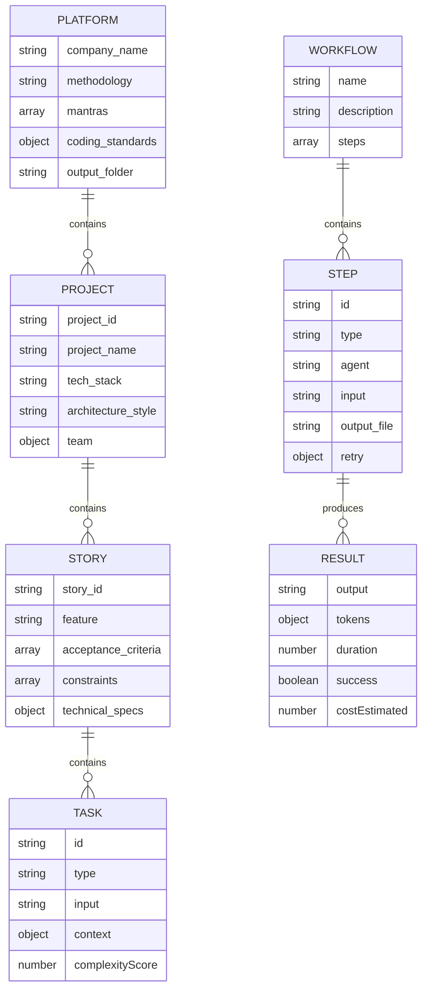

# BYAN v2.0 - Modèles de Données

**Version:** 2.0.0-HYPER-MVP  
**Date:** 2026-02-04  
**Status:** Design Phase  
**Auteur:** Yan

---

## Table des matières

- [Vue d'ensemble](#vue-densemble)
- [Structures YAML](#structures-yaml)
- [Objets JavaScript](#objets-javascript)
- [Schémas de Validation](#schémas-de-validation)
- [Exemples Concrets](#exemples-concrets)

---

## Vue d'ensemble

BYAN v2.0 utilise deux types de structures de données :

1. **Structures YAML** - Fichiers de configuration déclaratifs
2. **Objets JavaScript** - Structures runtime pour l'exécution

### Diagramme Entité-Relations



---

## Structures YAML

### 1. Platform Context (platform.yaml)

**Emplacement :** `_bmad/_context/platform.yaml`

**Description :** Context global partagé par tous les projets et stories.

#### Structure

```yaml
# Informations entreprise
company_name: string
methodology: string

# Chemins globaux
output_folder: string
project_root: string

# Standards et règles
mantras: array<string>
coding_standards: object
documentation_standards: object

# Configuration globale
communication_language: string
user_name: string
user_skill_level: string
```

#### Exemple Complet

```yaml
# Platform Context - Configuration Globale
company_name: "Acme Corporation"
methodology: "Merise Agile"
project_root: "/home/user/projects/acme"
output_folder: "{project_root}/_bmad-output"

# Communication
communication_language: "Francais"
user_name: "Yan"
user_skill_level: "intermediate"

# Mantras Merise Agile + TDD (64 mantras)
mantras:
  # Core principles
  - "Simplicity is the ultimate sophistication"
  - "Trust but verify"
  - "Challenge before confirm"
  - "Economic intelligence"
  - "Adaptive behavior"
  - "Context over convention"
  - "Fail safe defaults"
  - "Progressive disclosure"
  - "Convention over configuration"
  - "Optimize for change"
  # ... 54 autres mantras

# Standards de codage
coding_standards:
  javascript:
    style: "Airbnb ESLint"
    formatting: "Prettier"
    naming_conventions:
      classes: "PascalCase"
      functions: "camelCase"
      constants: "UPPER_SNAKE_CASE"
    testing:
      framework: "Jest"
      coverage_target: 80
      
  node:
    min_version: "18.0.0"
    package_manager: "npm"

# Standards de documentation
documentation_standards:
  format: "CommonMark"
  diagrams: "Mermaid"
  api_docs: "JSDoc"
  comments:
    min_complexity_for_doc: 5
    require_examples: true
```

#### Validation Rules

```javascript
const platformSchema = {
  company_name: { type: 'string', required: true },
  methodology: { type: 'string', required: true },
  output_folder: { type: 'string', required: true },
  mantras: { type: 'array', minLength: 1 },
  coding_standards: { type: 'object' },
  communication_language: { type: 'string', required: true }
};
```

---

### 2. Project Context (project.yaml)

**Emplacement :** `_bmad/_context/{projectId}/project.yaml`

**Description :** Context spécifique à un projet. Hérite de platform.yaml.

#### Structure

```yaml
# Identification projet
project_id: string
project_name: string
project_description: string

# Architecture technique
tech_stack: string
architecture_style: string
database: string
deployment_target: string

# Équipe
team:
  pm: string
  architect: string
  developers: array<string>
  
# Artifacts
planning_artifacts: string
implementation_artifacts: string
project_knowledge: string
```

#### Exemple Complet

```yaml
# Project Context - ERP System
project_id: "erp-system"
project_name: "ERP System v2.0"
project_description: "Enterprise Resource Planning system with microservices architecture"

# Stack technique
tech_stack: "Node.js >= 18.0.0, React 18, PostgreSQL 15"
architecture_style: "Microservices"
database: "PostgreSQL 15"
deployment_target: "Kubernetes (AWS EKS)"

# Services
services:
  - name: "auth-service"
    port: 3001
    database: "auth_db"
  - name: "user-service"
    port: 3002
    database: "users_db"
  - name: "inventory-service"
    port: 3003
    database: "inventory_db"

# Équipe
team:
  pm: "John Smith"
  architect: "Sarah Connor"
  tech_lead: "Michael Chen"
  developers:
    - "Alice Johnson"
    - "Bob Williams"
    - "Carol Martinez"

# Chemins artifacts (hérite de platform si non redéfini)
planning_artifacts: "{project_root}/erp-system/_bmad-output/planning"
implementation_artifacts: "{project_root}/erp-system/_bmad-output/implementation"
project_knowledge: "{project_root}/erp-system/docs"

# Configuration CI/CD
ci_cd:
  platform: "GitHub Actions"
  test_automation: true
  deploy_on_merge: true
  environments:
    - "development"
    - "staging"
    - "production"
```

#### Validation Rules

```javascript
const projectSchema = {
  project_id: { type: 'string', required: true, pattern: /^[a-z0-9-]+$/ },
  project_name: { type: 'string', required: true },
  tech_stack: { type: 'string', required: true },
  architecture_style: { type: 'string', enum: ['Monolith', 'Microservices', 'Serverless'] },
  team: { type: 'object', required: true }
};
```

---

### 3. Story Context (story.yaml)

**Emplacement :** `_bmad/_context/{projectId}/{storyId}/story.yaml`

**Description :** Context spécifique à une user story. Hérite de project.yaml + platform.yaml.

#### Structure

```yaml
# Identification story
story_id: string
story_type: string  # feature | bugfix | refactor | spike
feature: string
priority: string    # critical | high | medium | low

# Spécifications
user_story: string
acceptance_criteria: array<string>
technical_specs: object
constraints: array<string>

# Estimation
complexity: number  # 1-100
estimated_points: number  # Story points

# Relations
epic_id: string
related_stories: array<string>
dependencies: array<string>
```

#### Exemple Complet

```yaml
# Story Context - User Authentication
story_id: "US-123"
story_type: "feature"
feature: "User Authentication with OAuth2"
priority: "critical"

# User Story
user_story: |
  As a user, I want to log in using OAuth2 providers (Google, GitHub)
  So that I can securely access the ERP system without managing another password.

# Acceptance Criteria
acceptance_criteria:
  - "User can click 'Login with Google' and authenticate via OAuth2"
  - "User can click 'Login with GitHub' and authenticate via OAuth2"
  - "User session expires after 24 hours of inactivity"
  - "User can manually log out and session is destroyed"
  - "Failed authentication attempts are logged for security audit"
  - "RGPD compliance: user data consent is collected"

# Technical Specifications
technical_specs:
  oauth_providers:
    - provider: "Google"
      client_id: "{env.GOOGLE_CLIENT_ID}"
      scopes: ["email", "profile"]
    - provider: "GitHub"
      client_id: "{env.GITHUB_CLIENT_ID}"
      scopes: ["user:email"]
  
  session_management:
    storage: "Redis"
    ttl: 86400  # 24 hours
    refresh_token_enabled: true
  
  security:
    encryption: "AES-256"
    token_signing: "RS256"
    rate_limiting: "100 requests/hour per IP"

# Contraintes
constraints:
  - "RGPD compliance required (user consent, data portability)"
  - "Support mobile and desktop browsers"
  - "Response time < 2 seconds for authentication flow"
  - "99.9% availability SLA"

# Estimation
complexity: 65  # Complexe
estimated_points: 8

# Relations
epic_id: "EPIC-10"
related_stories:
  - "US-124"  # Two-factor authentication
  - "US-125"  # Password reset flow
dependencies:
  - "US-110"  # User database schema (must be completed first)
```

#### Validation Rules

```javascript
const storySchema = {
  story_id: { type: 'string', required: true, pattern: /^US-\d+$/ },
  story_type: { type: 'string', required: true, enum: ['feature', 'bugfix', 'refactor', 'spike'] },
  feature: { type: 'string', required: true },
  priority: { type: 'string', enum: ['critical', 'high', 'medium', 'low'] },
  acceptance_criteria: { type: 'array', minLength: 1 },
  complexity: { type: 'number', min: 1, max: 100 }
};
```

---

### 4. Workflow Definition (workflow.yaml)

**Emplacement :** `_bmad/workflows/{workflowName}/workflow.yaml`

**Description :** Définition déclarative d'un workflow orchestrant des agents et workers.

#### Structure

```yaml
# Métadonnées
name: string
description: string
version: string

# Configuration
config:
  execution_mode: string  # sequential | parallel
  timeout: number         # seconds
  
# Étapes du workflow
steps: array<object>
  - id: string
    type: string          # agent | worker
    agent: string         # si type=agent
    input: string
    output_file: string   # optionnel
    retry:
      max_attempts: number
      backoff: string     # exponential | linear | constant
```

#### Exemple Complet : Workflow Simple

```yaml
# Workflow: Format Document
name: format-document
description: "Validate and format a markdown document"
version: "1.0.0"

config:
  execution_mode: sequential
  timeout: 300  # 5 minutes

steps:
  - id: validate_syntax
    type: worker
    input: "Validate markdown syntax for: {document_content}"
    retry:
      max_attempts: 2
      backoff: exponential
  
  - id: format_content
    type: worker
    input: "Format markdown with consistent style: {document_content}"
    output_file: "{output_folder}/formatted.md"
    retry:
      max_attempts: 3
      backoff: exponential
  
  - id: verify_output
    type: worker
    input: "Verify formatted document is valid: {step.format_content.output}"
```

#### Exemple Complet : Workflow Complexe Multi-Agent

```yaml
# Workflow: Create Product Requirements Document
name: create-product-requirements
description: "Generate comprehensive PRD with analysis and validation"
version: "2.0.0"

config:
  execution_mode: sequential
  timeout: 1800  # 30 minutes

steps:
  # Step 1: Worker extracts requirements
  - id: extract_requirements
    type: worker
    input: |
      Extract all user requirements from the following input:
      {user_input}
      
      Focus on:
      - Functional requirements
      - Non-functional requirements
      - Constraints
      - Acceptance criteria
    output_file: "{output_folder}/raw-requirements.txt"
    retry:
      max_attempts: 3
      backoff: exponential
  
  # Step 2: Analyst agent analyzes requirements
  - id: analyze_requirements
    type: agent
    agent: analyst
    input: |
      Analyze the following requirements and provide:
      1. Requirement completeness assessment
      2. Risk analysis
      3. Feasibility study
      4. Recommendations
      
      Requirements:
      {step.extract_requirements.output}
      
      Context:
      Project: {project_name}
      Tech Stack: {tech_stack}
    output_file: "{output_folder}/analysis.md"
    retry:
      max_attempts: 2
      backoff: exponential
  
  # Step 3: PM agent generates PRD
  - id: generate_prd
    type: agent
    agent: pm
    input: |
      Generate a comprehensive Product Requirements Document (PRD) based on:
      
      Requirements:
      {step.extract_requirements.output}
      
      Analysis:
      {step.analyze_requirements.output}
      
      PRD must include:
      - Executive summary
      - Problem statement
      - Goals and objectives
      - User stories
      - Functional requirements
      - Non-functional requirements
      - Technical specifications
      - Success metrics
      - Timeline and milestones
      
      Follow {methodology} methodology.
    output_file: "{output_folder}/prd.md"
    retry:
      max_attempts: 2
      backoff: exponential
  
  # Step 4: Worker validates PRD structure
  - id: validate_prd
    type: worker
    input: |
      Validate the PRD structure and completeness:
      {step.generate_prd.output}
      
      Check:
      - All required sections present
      - Markdown formatting valid
      - No missing placeholders
      - Acceptance criteria are testable
    retry:
      max_attempts: 2
      backoff: constant
  
  # Step 5: Architect agent reviews technical feasibility
  - id: technical_review
    type: agent
    agent: architect
    input: |
      Review technical feasibility of the PRD:
      {step.generate_prd.output}
      
      Project context:
      - Tech Stack: {tech_stack}
      - Architecture: {architecture_style}
      - Constraints: {constraints}
      
      Provide:
      1. Technical feasibility score (1-10)
      2. Architecture recommendations
      3. Potential technical challenges
      4. Mitigation strategies
    output_file: "{output_folder}/technical-review.md"
    retry:
      max_attempts: 2
      backoff: exponential
```

#### Validation Rules

```javascript
const workflowSchema = {
  name: { type: 'string', required: true, pattern: /^[a-z0-9-]+$/ },
  description: { type: 'string', required: true },
  steps: { type: 'array', minLength: 1, required: true },
  'steps[].id': { type: 'string', required: true },
  'steps[].type': { type: 'string', required: true, enum: ['agent', 'worker'] },
  'steps[].input': { type: 'string', required: true }
};
```

---

## Objets JavaScript

### 1. Task Object

**Description :** Représente une tâche à exécuter par un Worker ou Agent.

#### Interface

```javascript
/**
 * @typedef {Object} Task
 * @property {string} id - Identifiant unique de la tâche
 * @property {string} type - Type de tâche (validation, formatting, extraction, analysis, generation, reasoning, architecture)
 * @property {string} input - Input texte de la tâche
 * @property {Object} context - Context hiérarchique associé
 * @property {string} [agentName] - Nom de l'agent si type=agent
 * @property {number} [complexityScore] - Score calculé par le dispatcher (0-100)
 */
```

#### Exemple

```javascript
const task = {
  id: 'analyze_requirements',
  type: 'extraction',
  input: 'Extract requirements from: As a user, I want to log in...',
  context: {
    company_name: 'Acme Corp',
    project_name: 'ERP System',
    story_id: 'US-123'
  },
  complexityScore: 35
};
```

---

### 2. Result Object

**Description :** Résultat de l'exécution d'une tâche.

#### Interface

```javascript
/**
 * @typedef {Object} Result
 * @property {string} output - Output généré par l'executor
 * @property {Object} tokens - Compteurs de tokens
 * @property {number} tokens.input - Tokens d'entrée
 * @property {number} tokens.output - Tokens de sortie
 * @property {number} tokens.total - Total tokens
 * @property {number} duration - Durée d'exécution en secondes
 * @property {boolean} success - true si succès, false si échec
 * @property {number} costEstimated - Coût estimé en USD
 * @property {boolean} [fallbackUsed] - true si fallback worker→agent utilisé
 * @property {Error} [error] - Erreur si échec
 */
```

#### Exemple Succès

```javascript
const result = {
  output: "Requirements extracted:\n1. User authentication\n2. OAuth2 support",
  tokens: {
    input: 120,
    output: 250,
    total: 370
  },
  duration: 1.85,
  success: true,
  costEstimated: 0.00045,
  fallbackUsed: false
};
```

#### Exemple Échec

```javascript
const result = {
  output: null,
  tokens: {
    input: 120,
    output: 0,
    total: 120
  },
  duration: 3.2,
  success: false,
  costEstimated: 0.00015,
  fallbackUsed: false,
  error: new Error('Worker timeout after 3 seconds')
};
```

---

### 3. Context Object

**Description :** Context hiérarchique merged (platform + project + story).

#### Interface

```javascript
/**
 * @typedef {Object} Context
 * @property {string} company_name - Nom de l'entreprise (de platform)
 * @property {string} methodology - Méthodologie (de platform)
 * @property {Array<string>} mantras - Mantras (de platform)
 * @property {string} [project_id] - ID projet (de project, si chargé)
 * @property {string} [project_name] - Nom projet (de project, si chargé)
 * @property {string} [tech_stack] - Stack technique (de project, si chargé)
 * @property {string} [story_id] - ID story (de story, si chargé)
 * @property {string} [feature] - Feature (de story, si chargé)
 * @property {Array<string>} [acceptance_criteria] - Critères (de story, si chargé)
 * @property {...*} - Autres propriétés selon niveau chargé
 */
```

#### Exemple Platform Context

```javascript
const platformContext = {
  company_name: "Acme Corp",
  methodology: "Merise Agile",
  output_folder: "/home/user/project/_bmad-output",
  mantras: [
    "Simplicity is the ultimate sophistication",
    "Trust but verify",
    // ... 62 autres
  ],
  coding_standards: { ... }
};
```

#### Exemple Story Context (Merged)

```javascript
const storyContext = {
  // De platform.yaml
  company_name: "Acme Corp",
  methodology: "Merise Agile",
  mantras: [...],
  
  // De project.yaml
  project_id: "erp-system",
  project_name: "ERP System",
  tech_stack: "Node.js >= 18.0.0",
  architecture_style: "Microservices",
  
  // De story.yaml
  story_id: "US-123",
  feature: "User Authentication with OAuth2",
  priority: "critical",
  acceptance_criteria: [
    "User can login with Google",
    "User can login with GitHub",
    "Session expires after 24h"
  ],
  technical_specs: {
    oauth_providers: [...],
    session_management: {...}
  },
  constraints: [
    "RGPD compliance required"
  ]
};
```

---

### 4. Workflow Result Object

**Description :** Résultat de l'exécution d'un workflow complet.

#### Interface

```javascript
/**
 * @typedef {Object} WorkflowResult
 * @property {string} workflowName - Nom du workflow exécuté
 * @property {number} stepsExecuted - Nombre d'étapes exécutées
 * @property {Object<string, Result>} results - Résultats par step (key: step.id)
 * @property {boolean} success - true si toutes les étapes ont réussi
 * @property {number} totalDuration - Durée totale en secondes
 * @property {Object} totalTokens - Total tokens agrégé
 * @property {number} totalCost - Coût total estimé en USD
 * @property {Array<Object>} errors - Liste des erreurs rencontrées
 */
```

#### Exemple

```javascript
const workflowResult = {
  workflowName: "create-product-requirements",
  stepsExecuted: 5,
  results: {
    extract_requirements: {
      output: "Requirements:\n1. OAuth2 authentication\n2. Session management",
      tokens: { input: 150, output: 200, total: 350 },
      duration: 2.1,
      success: true,
      costEstimated: 0.0004
    },
    analyze_requirements: {
      output: "Analysis:\nRequirements are complete and feasible...",
      tokens: { input: 500, output: 800, total: 1300 },
      duration: 4.2,
      success: true,
      costEstimated: 0.0039
    },
    generate_prd: {
      output: "# Product Requirements Document\n\n## Executive Summary...",
      tokens: { input: 800, output: 1500, total: 2300 },
      duration: 5.8,
      success: true,
      costEstimated: 0.0069
    },
    validate_prd: {
      output: "PRD validation: All sections present, structure valid",
      tokens: { input: 1500, output: 50, total: 1550 },
      duration: 1.2,
      success: true,
      costEstimated: 0.0019
    },
    technical_review: {
      output: "Technical Feasibility: 8/10\nRecommendations...",
      tokens: { input: 1600, output: 600, total: 2200 },
      duration: 4.5,
      success: true,
      costEstimated: 0.0066
    }
  },
  success: true,
  totalDuration: 17.8,
  totalTokens: {
    input: 4550,
    output: 3150,
    total: 7700
  },
  totalCost: 0.0197,
  errors: []
};
```

---

## Schémas de Validation

### Validation avec Yup (Recommandé)

**Installation :**

```bash
npm install yup
```

#### Platform Context Schema

```javascript
const yup = require('yup');

const platformContextSchema = yup.object({
  company_name: yup.string().required(),
  methodology: yup.string().required(),
  output_folder: yup.string().required(),
  communication_language: yup.string().required(),
  mantras: yup.array().of(yup.string()).min(1),
  coding_standards: yup.object(),
  documentation_standards: yup.object()
});

// Validation
try {
  await platformContextSchema.validate(platformContext);
  console.log('Platform context valid');
} catch (error) {
  console.error('Validation error:', error.errors);
}
```

#### Project Context Schema

```javascript
const projectContextSchema = yup.object({
  project_id: yup.string()
    .required()
    .matches(/^[a-z0-9-]+$/, 'project_id must be lowercase alphanumeric with hyphens'),
  project_name: yup.string().required(),
  tech_stack: yup.string().required(),
  architecture_style: yup.string()
    .oneOf(['Monolith', 'Microservices', 'Serverless']),
  team: yup.object({
    pm: yup.string(),
    architect: yup.string(),
    developers: yup.array().of(yup.string())
  }).required()
});
```

#### Story Context Schema

```javascript
const storyContextSchema = yup.object({
  story_id: yup.string()
    .required()
    .matches(/^US-\d+$/, 'story_id must be format US-123'),
  story_type: yup.string()
    .required()
    .oneOf(['feature', 'bugfix', 'refactor', 'spike']),
  feature: yup.string().required(),
  priority: yup.string()
    .oneOf(['critical', 'high', 'medium', 'low']),
  acceptance_criteria: yup.array()
    .of(yup.string())
    .min(1)
    .required(),
  complexity: yup.number()
    .min(1)
    .max(100),
  estimated_points: yup.number().positive()
});
```

#### Workflow Schema

```javascript
const workflowSchema = yup.object({
  name: yup.string()
    .required()
    .matches(/^[a-z0-9-]+$/, 'workflow name must be kebab-case'),
  description: yup.string().required(),
  version: yup.string()
    .matches(/^\d+\.\d+\.\d+$/, 'version must be semver'),
  steps: yup.array()
    .of(
      yup.object({
        id: yup.string().required(),
        type: yup.string()
          .required()
          .oneOf(['agent', 'worker']),
        agent: yup.string().when('type', {
          is: 'agent',
          then: yup.string().required(),
          otherwise: yup.string().notRequired()
        }),
        input: yup.string().required(),
        output_file: yup.string(),
        retry: yup.object({
          max_attempts: yup.number().positive().max(10),
          backoff: yup.string()
            .oneOf(['exponential', 'linear', 'constant'])
        })
      })
    )
    .min(1)
    .required()
});
```

### Validation Helper Functions

```javascript
/**
 * Valide un context YAML selon son niveau
 */
async function validateContext(level, data) {
  const schemas = {
    platform: platformContextSchema,
    project: projectContextSchema,
    story: storyContextSchema
  };
  
  try {
    await schemas[level].validate(data, { abortEarly: false });
    return { valid: true, errors: [] };
  } catch (error) {
    return {
      valid: false,
      errors: error.errors
    };
  }
}

/**
 * Valide un workflow YAML
 */
async function validateWorkflow(workflowData) {
  try {
    await workflowSchema.validate(workflowData, { abortEarly: false });
    return { valid: true, errors: [] };
  } catch (error) {
    return {
      valid: false,
      errors: error.errors
    };
  }
}
```

---

## Exemples Concrets

### Exemple 1 : Workflow "Create Simple PRD"

**Fichier : `_bmad/workflows/create-simple-prd/workflow.yaml`**

```yaml
name: create-simple-prd
description: "Generate a simple Product Requirements Document"
version: "1.0.0"

config:
  execution_mode: sequential
  timeout: 600

steps:
  - id: extract_requirements
    type: worker
    input: "Extract requirements from: {user_input}"
    output_file: "{output_folder}/requirements.txt"
    retry:
      max_attempts: 3
      backoff: exponential
  
  - id: generate_prd
    type: agent
    agent: pm
    input: "Generate PRD based on: {step.extract_requirements.output}"
    output_file: "{output_folder}/prd.md"
    retry:
      max_attempts: 2
      backoff: exponential
```

**Exécution JavaScript :**

```javascript
const executor = new WorkflowExecutor(contextLayer, dispatcher, logger);

const context = await contextLayer.loadContext('story', {
  projectId: 'erp-system',
  storyId: 'US-123'
});

const result = await executor.execute(
  '_bmad/workflows/create-simple-prd/workflow.yaml',
  {
    ...context,
    user_input: "I need a user authentication system with OAuth2"
  }
);

console.log(`PRD generated: ${result.results.generate_prd.output}`);
```

---

### Exemple 2 : Context Hiérarchique Complet

**Platform Context :**

```yaml
# _bmad/_context/platform.yaml
company_name: "Acme Corp"
methodology: "Merise Agile"
output_folder: "/home/user/projects/_bmad-output"
```

**Project Context :**

```yaml
# _bmad/_context/erp-system/project.yaml
project_id: "erp-system"
project_name: "ERP System v2.0"
tech_stack: "Node.js >= 18.0.0"
# Hérite: company_name, methodology, output_folder
```

**Story Context :**

```yaml
# _bmad/_context/erp-system/US-123/story.yaml
story_id: "US-123"
feature: "User Authentication"
acceptance_criteria:
  - "User can login with OAuth2"
# Hérite: tout de project + platform
```

**Résolution JavaScript :**

```javascript
const context = await contextLayer.loadContext('story', {
  projectId: 'erp-system',
  storyId: 'US-123'
});

console.log(context);
// {
//   company_name: "Acme Corp",           // de platform
//   methodology: "Merise Agile",         // de platform
//   output_folder: "/home/user/...",     // de platform
//   project_id: "erp-system",            // de project
//   project_name: "ERP System v2.0",     // de project
//   tech_stack: "Node.js >= 18.0.0",     // de project
//   story_id: "US-123",                  // de story
//   feature: "User Authentication",      // de story
//   acceptance_criteria: [...]           // de story
// }
```

---

### Exemple 3 : Task avec Routing Intelligent

```javascript
// Tâche simple → Worker
const simpleTask = {
  id: 'format_markdown',
  type: 'formatting',
  input: 'Format this markdown: # Title\n\nContent',
  context: platformContext
};

const complexity1 = dispatcher.calculateComplexity(simpleTask);
console.log(complexity1); // ~18

const executor1 = await dispatcher.routeTask(simpleTask);
console.log(executor1.constructor.name); // Worker

// Tâche complexe → Agent
const complexTask = {
  id: 'design_architecture',
  type: 'architecture',
  input: 'Design a scalable microservices architecture for e-commerce',
  context: storyContext
};

const complexity2 = dispatcher.calculateComplexity(complexTask);
console.log(complexity2); // ~95

const executor2 = await dispatcher.routeTask(complexTask);
console.log(executor2.constructor.name); // Agent
```

---

### Exemple 4 : Workflow avec Retry Logic

**Workflow YAML :**

```yaml
name: resilient-workflow
description: "Workflow with comprehensive retry logic"
version: "1.0.0"

steps:
  - id: flaky_task
    type: worker
    input: "Process data: {input_data}"
    retry:
      max_attempts: 5
      backoff: exponential
  
  - id: critical_task
    type: agent
    agent: architect
    input: "Critical analysis: {step.flaky_task.output}"
    retry:
      max_attempts: 3
      backoff: exponential
```

**Exécution :**

```javascript
const result = await executor.execute(
  '_bmad/workflows/resilient-workflow/workflow.yaml',
  { input_data: 'Sample data' }
);

// Si flaky_task échoue aux tentatives 1-4 mais réussit à la 5e:
// result.results.flaky_task.retryAttempts = 5
// result.results.flaky_task.success = true

// Logs structurés capturent chaque tentative
logger.logs.filter(log => log.task_id === 'flaky_task');
// [
//   { attempt: 1, success: false, error: "Timeout" },
//   { attempt: 2, success: false, error: "Timeout" },
//   { attempt: 3, success: false, error: "Timeout" },
//   { attempt: 4, success: false, error: "Timeout" },
//   { attempt: 5, success: true }
// ]
```

---

## Références

**Documents liés :**
- [Vision et Principes](./01-vision-et-principes.md)
- [Interfaces API](./04-interfaces-api.md)
- [Flux de Données](./06-flux-de-donnees.md)
- [Architecture Technique](../architecture/byan-v2-0-architecture-node.md)

**Standards de Validation :**
- [Yup Documentation](https://github.com/jquense/yup)
- [YAML Specification](https://yaml.org/spec/1.2/spec.html)
- [JSDoc Standards](https://jsdoc.app/)

---

**Document créé le 2026-02-04**  
*BYAN v2.0 - Modèles de Données*  
*Auteur : Yan | Technical Writer : Paige*
