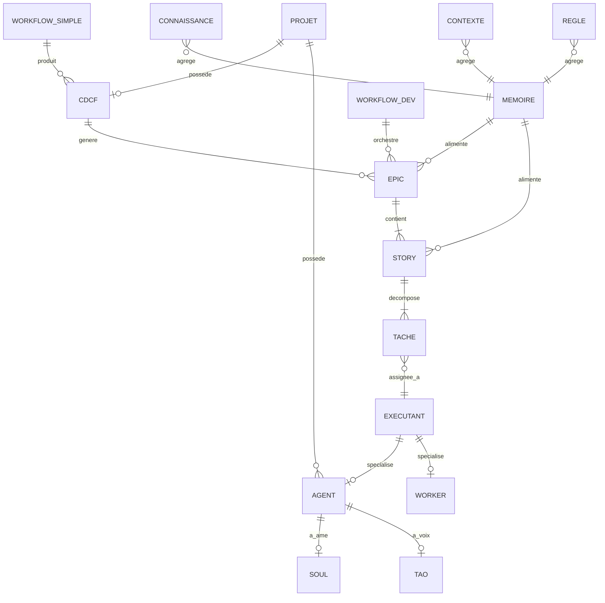

# F1 — Dictionnaire de Donnees + MCD (nouveau modele BYAN)

> Livrable de conception, FD `byan-refactor-cli-workflows`, feature F1.
> Methodologie Merise Agile (Data Dictionary First, Mantra #33).
> Ancre sur les formats reels existants (exploration du depot) + le drawio cible
> (`docs/refactor/target-model.drawio`).
> Statut : **valide** (decisions D1-D4 tranchees le 2026-05-27). Socle de F2/F4/F7/F8.

## 0. Objet et perimetre

Ce document fige les **entites de donnees** du nouveau modele BYAN avant tout code.
Deux zones structurent le modele :

- **Zone SYSTEME** — la plateforme BYAN, installee par le yanstaller : agents systeme,
  workers, workflows de base, regles, connaissances, contextes, memoire de plateforme.
- **Zone PROJET** — un dossier par projet (`_byan/projet/<slug>/`) : CDCF, Epics, Stories,
  Taches, plus eventuellement agents/workers/contextes propres au projet.

Statut par entite : **EXISTANT** (deja sur disque), **PATTERN** (concept present non
structure), **NOUVEAU** (a creer).

## 1. Acteurs et moteur (hors donnees persistantes)

| Noeud | Nature | Role |
|-------|--------|------|
| Actor | Acteur externe | Emet le Prompt (l'utilisateur) |
| BYAN | Moteur | Point d'entree, recoit le Prompt, appelle Hermes |
| Hermes | Moteur (dispatcher) | Route vers Epic/Story puis Agent/Worker selon complexite |
| Complexite | **Attribut calcule** (D2) | Score porte par la Tache (agrege au niveau Story), pilote le dispatch. Pas une entite (Ockham #37) |

## 2. Dictionnaire de donnees (12 entites)

Type : `str`, `int`, `enum`, `date`, `bool`, `ref(Entite)`, `list<...>`, `map`, `text`.
Obl. : O = obligatoire, o = optionnel.

### 2.1 Agent — EXISTANT — zone SYSTEME (+ PROJET)
Executant a forte complexite. Fichier `.md` (frontmatter + corps XML) + soul/tao optionnels.

| Attribut | Type | Obl. | Description |
|----------|------|------|-------------|
| name | str | O | Identifiant kebab-case |
| title | str | O | Nom affichable |
| icon | str | o | Pictogramme menu |
| role | str | O | Fonction |
| identity | text | O | Qui il est, expertise |
| communication_style | text | O | Ton, registre |
| principles | text | O | Comportements moteurs |
| scope | enum | O | systeme / projet (remplace l'ancien `module`, D4) |
| provenance | str | o | Tag origine migration (ex: bmm, bmb) pour tracabilite (D4) |
| path | str | O | Chemin du fichier |
| soul | ref(Soul) | o | 0,1 ame attachee |
| tao | ref(Tao) | o | 0,1 voix attachee |
| model | enum | o | opus/sonnet/haiku |

### 2.2 Worker — DESIGNE (`_byan/workers.md`) -> NOUVEAU comme entite (formalisation F4/F5, D3) — zone SYSTEME (+ PROJET)
Executant a faible complexite, modele leger, peu couteux.

| Attribut | Type | Obl. | Description |
|----------|------|------|-------------|
| name | str | O | Identifiant |
| model | enum | O | haiku / mini |
| complexity_max | int | O | Seuil de complexite traitable |
| type | enum | O | task-worker / feature-worker |
| cost_per_call | float | o | Cout indicatif |
| pool_size | int | o | Taille du pool |

### 2.3 Workflow — EXISTANT — zone SYSTEME
Orchestration multi-etapes. Distinction centrale : `simple` (inchange) vs `dev` (atomique).

| Attribut | Type | Obl. | Description |
|----------|------|------|-------------|
| name | str | O | Identifiant |
| description | str | O | But |
| kind | enum | O | **simple** (taches non-dev) / **dev** (atomique projet) |
| mode | enum | o | mono / tri-modal (create/validate/edit) |
| steps | list<ref(Step)> | O | Micro-fichiers ordonnes |
| scope | enum | o | systeme / projet (D4) |
| path | str | O | Chemin |

### 2.4 Projet — IMPLICITE -> NOUVEAU comme entite explicite — racine zone PROJET
Aligne sur le modele byan_web (`projects`: id, name, type, visibility).

| Attribut | Type | Obl. | Description |
|----------|------|------|-------------|
| slug | str | O | Identifiant unique (dossier) |
| name | str | O | Nom |
| description | text | o | Resume |
| type | enum | O | dev / training |
| stack | str | o | Stack technique |
| status | enum | O | draft / active / archived |
| created_at | date | O | Creation |

### 2.5 CDCF (Cahier des Charges Fonctionnel) — NOUVEAU — zone PROJET
Produit par un **workflow simple** depuis la discussion projet. Source des Epics.

| Attribut | Type | Obl. | Description |
|----------|------|------|-------------|
| id | str | O | Identifiant |
| projet | ref(Projet) | O | Projet rattache (1,1) |
| titre | str | O | Intitule |
| besoins | list<text> | O | Exigences fonctionnelles |
| perimetre | text | O | Dans / hors scope |
| contraintes | list<text> | o | Techniques, delais, budget |
| criteres_acceptation | list<text> | O | Globaux, niveau projet |
| status | enum | O | draft / valide |
| date | date | O | Redaction |

### 2.6 Epic — PATTERN -> NOUVEAU — zone PROJET
Issu du CDCF.

| Attribut | Type | Obl. | Description |
|----------|------|------|-------------|
| id | str | O | Identifiant (E1...) |
| cdcf | ref(CDCF) | O | Source (1,1) |
| projet | ref(Projet) | O | Denormalise pour requete |
| titre | str | O | Intitule |
| objectif | text | O | But |
| value_statement | text | o | Valeur metier |
| size | enum | O | S / M / L / XL |
| priorite | enum | O | P0 / P1 / P2 / P3 |
| status | enum | O | pending / in-progress / done |

### 2.7 Story (User Story) — PATTERN -> NOUVEAU — zone PROJET
Contenue dans un Epic.

| Attribut | Type | Obl. | Description |
|----------|------|------|-------------|
| id | str | O | Identifiant (S1.1...) |
| epic | ref(Epic) | O | Epic parent (1,1) |
| role | str | O | "As a {role}" |
| want | text | O | "I want {feature}" |
| benefit | text | O | "So that {benefit}" |
| criteres_acceptation | list<text> | O | Given/When/Then |
| dependances | list<ref(Story)> | o | Stories prerequises |
| estimation | int | o | Story Points |
| notes_techniques | text | o | Guidage |
| status | enum | O | pending / in-progress / done |

### 2.8 Tache (atomique) — PATTERN -> NOUVEAU — zone PROJET
Unite atomique sous une Story. **Le "Task standalone" legacy est renomme `Commande` (D1).**

| Attribut | Type | Obl. | Description |
|----------|------|------|-------------|
| id | str | O | Identifiant |
| story | ref(Story) | O | Story parente (1,1) |
| titre | str | O | Intitule court |
| description | text | O | Quoi faire |
| complexite_score | int | O | Score (pilote le dispatch) |
| complexite_niveau | enum | O | faible / elevee (derive du score) |
| executant | ref(Executant) | o | Agent ou Worker assigne (1,1 a l'execution) |
| dependances | list<ref(Tache)> | o | Taches prerequises (cf. point ouvert P3) |
| status | enum | O | pending / in-progress / done / blocked |

### 2.9 Connaissance — EXISTANT (`_byan/knowledge/sources.md`) — zone SYSTEME (+ PROJET)
Source verifiee citable. Alimente la Memoire.

| Attribut | Type | Obl. | Description |
|----------|------|------|-------------|
| id | str | O | Identifiant |
| niveau | enum | O | L1..L5 (plancher de preuve) |
| source | str | O | Reference exacte |
| domaine | str | O | security / performance / ... |
| contenu | text | O | Le savoir |
| date_verif | date | o | Derniere verification |
| confiance | int | o | Score % |
| expiry | date | o | Peremption (demi-vie par domaine) |

### 2.10 Contexte — EXISTANT (`config.yaml`, contexte projet) — zone SYSTEME + PROJET
Variables runtime hierarchiques. Alimente la Memoire.

| Attribut | Type | Obl. | Description |
|----------|------|------|-------------|
| id | str | O | Identifiant |
| niveau | enum | O | platform / project / story |
| variables | map | O | cles/valeurs (paths, langue, user...) |
| scope_ref | ref | o | Projet ou Story selon niveau |

### 2.11 Regle — EXISTANT (`config.yaml` bmad_features, mantras, `.claude/rules`) — zone SYSTEME
Contrainte de comportement. Alimente la Memoire.

| Attribut | Type | Obl. | Description |
|----------|------|------|-------------|
| id | str | O | Identifiant (IA-16, STRICT-2...) |
| type | enum | O | mantra / feature-toggle / seuil |
| scope | enum | O | global / module / projet |
| contenu | text | O | Enonce |
| seuil | str | o | Valeur (ex: min_score 80) |

### 2.12 Memoire — EXISTANT (`_byan/_memory/`) — zone SYSTEME + PROJET
Agregat vivant, nourri par Contexte + Regle + Connaissance, alimente l'execution.

| Attribut | Type | Obl. | Description |
|----------|------|------|-------------|
| id | str | O | Identifiant |
| portee | enum | O | systeme / projet |
| soul_memory | text | o | Journal narratif (RESONANCE/TENSION/...) |
| fact_graph | list<ref(Connaissance)> | o | Cache de faits verifies |
| elo_profile | map | o | Scores de confiance par domaine |
| sources | list<ref> | O | Contexte+Regle+Connaissance agreges |

### Entites faibles attachees a l'Agent
**Soul** et **Tao** (EXISTANT, `*-soul.md` / `*-tao.md`) : 0,1 par Agent, dependantes
(n'existent pas sans l'Agent).

## 3. Generalisation : Executant

```
Executant (abstrait)
  <|-- Agent   (complexite elevee)
  <|-- Worker  (complexite faible)
```
Une Tache est assignee a exactement un Executant (Agent XOR Worker), choisi par Hermes
selon `complexite_niveau`.

## 4. Modele Conceptuel — associations + cardinalites

Notation Merise (min,max).

| Association | Entite A | Card. A | Entite B | Card. B | Sens |
|-------------|----------|---------|----------|---------|------|
| possede | Projet | (1,1) | CDCF | (0,1) | Un projet a au plus un CDCF |
| genere | CDCF | (1,1) | Epic | (0,n) | Un CDCF genere des epics |
| contient | Epic | (1,1) | Story | (1,n) | Un epic contient des stories |
| decompose | Story | (1,1) | Tache | (1,n) | Une story se decompose en taches |
| assignee_a | Tache | (1,1) | Executant | (0,n) | Une tache -> un executant |
| alimente_exec | Memoire | (1,1) | Epic/Story | (0,n) | La memoire nourrit l'execution |
| agrege_conn | Connaissance | (0,n) | Memoire | (1,1) | Connaissance -> memoire |
| agrege_ctx | Contexte | (0,n) | Memoire | (1,1) | Contexte -> memoire |
| agrege_regle | Regle | (0,n) | Memoire | (1,1) | Regle -> memoire |
| orchestre | Workflow(dev) | (1,1) | Epic | (0,n) | Le workflow_dev orchestre la boucle |
| produit | Workflow(simple) | (1,1) | CDCF | (0,n) | Le workflow simple produit le CDCF |
| possede_agent | Projet | (1,1) | Agent | (0,n) | Agents propres au projet |
| a_ame | Agent | (1,1) | Soul | (0,1) | Ame attachee |
| a_voix | Agent | (1,1) | Tao | (0,1) | Voix attachee |

### Diagramme MCD (mermaid erDiagram)



## 5. Decisions (VALIDEES 2026-05-27)

| # | Sujet | Decision |
|---|-------|----------|
| **D1** | Collision Tache atomique vs Task legacy | **Tache** = unite atomique sous Story. Le legacy "Task standalone" (task-manifest) est renomme **`Commande`** |
| **D2** | Complexite entite ou attribut | **Attribut** de la Tache (`complexite_score` + `complexite_niveau`) |
| **D3** | Worker spec vs fichiers | **Formalise en entites/fichiers reels** en F4/F5 |
| **D4** | Attribut `module` legacy | Devient **`scope`** (systeme/projet) + **`provenance`** (tag origine pour tracabilite migration F7) |

## 6. Cross-validation MCD / MCT (flux de traitement)

```
1. Actor emet Prompt                          -> entree (acteur)
2. BYAN recoit, appelle Hermes                -> moteur
3. Hermes dispatch -> Epic/Story              -> orchestre (Workflow dev) + genere/contient
4. Story -> Taches                            -> decompose
5. Tache.complexite_niveau -> Agent | Worker  -> generalisation Executant + assignee_a
6. Memoire (Contexte+Regle+Connaissance)      -> agrege_* + alimente_exec, en boucle
7. Resultats -> re-alimentent la Memoire      -> boucle (agregation de savoir)
```

Verification orphelins : chaque entite participe a >=1 association.
- Projet, CDCF, Epic, Story, Tache, Agent, Worker, Workflow, Connaissance, Contexte,
  Regle, Memoire : toutes rattachees. Soul/Tao -> Agent. **Aucune entite orpheline.**

## 7. Points ouverts pour la suite (F2/F4/F7)

- **P1** Format de fichier concret de chaque entite NOUVELLE (Epic/Story/Tache/CDCF) -> F2.
- **P2** Hierarchie de chargement du Contexte (platform/project/story) -> F2.
- **P3** Dependances inter-Taches : attribut `dependances` ajoute (symetrique des Stories),
  a detailler dans le runtime loop -> F2.
- **P4** Arborescence physique systeme/projet derivee de ce MCD -> F4.
- **P5** Mapping `module` legacy -> `scope`+`provenance`, renommage Task -> Commande -> F7.

## 8. Defaut identifie (hors scope F1, a corriger separement)

Le scope-guard du mode strict (2.17.x, `.claude/hooks/strict-scope-guard.js`,
fonction `matchesPrefix`) ne gere pas le suffixe glob `/**` : un `allowedPaths`
ecrit `docs/refactor/**` ne matche aucun fichier reel. Contournement : declarer les
prefixes sans glob (`docs/refactor`). A corriger dans un suivi dedie sur la branche
`feat/byan-strict-mode` (strip de `/**` et `/*` dans `matchesPrefix`).
